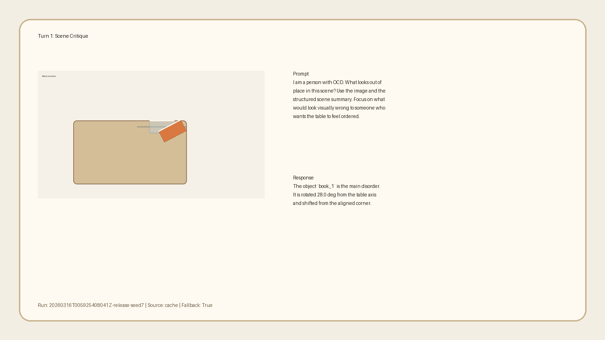
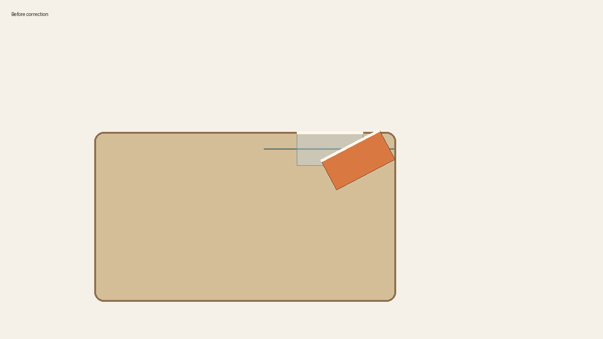
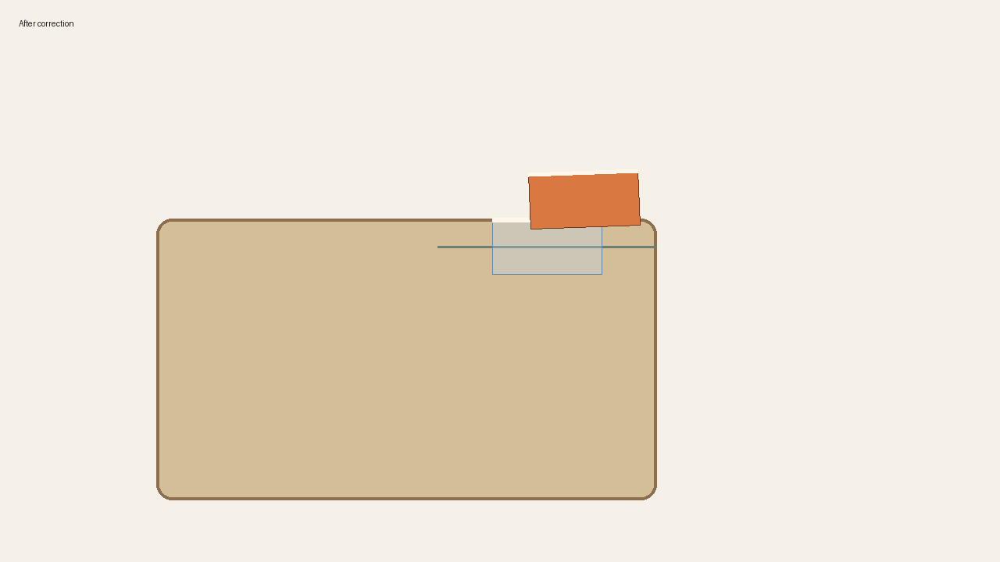
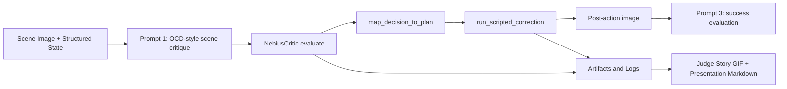

# rOCDbot Judge Demo Presentation

One-liner: We use OCD-informed LLM reasoning to drive high-precision robotic correction of out-of-place objects.

Long description: rOCDbot combines a language model that understands OCD-style ordering preferences with a closed-loop robotics pipeline. The system identifies a scene disorder, executes iterative actions to move the object to a precise target state, and evaluates completion quality. We preserve the full trace of initial observations, decisions, and actions as structured data used to improve future behavior through reinforcement-learning feedback.

---

## Demo Summary

- Run ID: `20260316T000345367892Z-release-seed7`
- Seed: `7`
- Decision source: `cache`
- Fallback used: `True`
- Yaw error: `28.0 deg -> 2.0 deg`
- Position error after action: `0.6 cm`
- Robot plan: `approach -> grasp -> lift -> rotate_to_target -> place -> settle`

## Visual Storyboard



### Before



### After



## Judge-Facing Prompt and Response Flow

### 1. What looks out of place?

Prompt:
> I am a person with OCD. What looks out of place in this scene? Use the image and the structured scene summary. Focus on what would look visually wrong to someone who wants the table to feel ordered.

Response:
> The object `book_1` is the main disorder. It is rotated 28.0 deg away from the table axis, so it does not look parallel to the surface and appears visually off.

### 2. What should the robot do?

Prompt:
> What are the instructions for the robot to put the object back in place so that it satisfies a person with OCD? Return short, concrete robot instructions.

Response:
> Robot plan: approach -> grasp -> lift -> rotate_to_target -> place -> settle. Target: rotate `book_1` back to 0.0 deg and place it centered on the target position.

### 3. Was the action successful?

Prompt:
> Evaluate how successful the action was. If the task is not completed, give a new action so that the object is in place.

Response:
> Result: yaw error improved from 28.0 deg to 2.0 deg and position error is 0.6 cm. Task complete. No further action required.

## Agent Logs

```json
{"step": 1, "event": "scene_captured", "image_path": "/tmp/rocdbot-release-check3/runs/20260316T000345367892Z-release-seed7/before.png", "scene_object": "book_1", "yaw_before_deg": 28.0}
{"step": 2, "event": "order_critique_generated", "decision_source": "cache", "fallback_used": true, "reason": "The object is rotated away from the table axis."}
{"step": 3, "event": "robot_plan_selected", "plan": ["approach", "grasp", "lift", "rotate_to_target", "place", "settle"], "execution_latency_ms": 18200}
{"step": 4, "event": "post_action_evaluated", "image_path": "/tmp/rocdbot-release-check3/runs/20260316T000345367892Z-release-seed7/after.png", "yaw_after_deg": 2.0, "position_error_after_cm": 0.6, "run_status": "success"}
```

## Metrics to Say Out Loud

- The object `book_1` starts visibly misaligned at `28.0 deg`.
- The robot reorients it to `2.0 deg`, which is inside the demo success threshold.
- Final position error is `0.6 cm`.
- The run used the `cache` critic path with `fallback_used=True`.

## System Architecture



## Files to Show During the Demo

- Storyboard GIF: [judge_story.gif](artifacts/release/judge_story.gif)
- Prompt/response JSON: [judge_conversation.json](artifacts/release/judge_conversation.json)
- Judge script: [judge_script.md](artifacts/release/judge_script.md)
- Agent logs: [judge_agent_log.jsonl](artifacts/release/judge_agent_log.jsonl)
- Manifest: [demo_manifest.json](artifacts/release/demo_manifest.json)

## Sponsor and Framework Usage Details

- Nebius Token Factory:
  - The sponsor-facing reasoning integration is implemented in `src/demo/critic.py`.
  - `NebiusCritic._live_transport()` builds the request with `NEBIUS_TOKEN_FACTORY_API_KEY`, `NEBIUS_TOKEN_FACTORY_BASE_URL`, and `NEBIUS_TOKEN_FACTORY_TEXT_MODEL`.
  - The API call uses `urllib.request.Request(...)` and `urllib.request.urlopen(...)` against the OpenAI-compatible `/chat/completions` endpoint.
  - `NebiusCritic.evaluate()` enforces schema validation and falls back to `cache/critic_response.json` with `ERR_NEBIUS_TIMEOUT` or `ERR_NEBIUS_SCHEMA`.
- Robotics runtime abstraction:
  - `PreparedSceneAdapter.reset_scene()`, `PreparedSceneAdapter.read_scene_state()`, `PreparedSceneAdapter.execute_plan()`, and `PreparedSceneAdapter.capture_frame()` define the simulator contract in `src/demo/isaac_adapter.py`.
  - `run_scripted_correction()` in `src/demo/executor.py` executes the primitive plan `["approach", "grasp", "lift", "rotate_to_target", "place", "settle"]`.
- Agent loop and orchestration:
  - `run_demo()` in `src/demo/run_live.py` orchestrates reset, reasoning, planning, execution, metrics, and artifact writing.
  - `map_decision_to_plan()` in `src/demo/planner.py` constrains language-model output to allowed robot primitives from `ALLOWED_PLAN`.
  - `compute_metrics()` in `src/demo/metrics.py` computes `yaw_before_deg`, `yaw_after_deg`, `position_error_after_cm`, `order_score_before`, and `order_score_after`.
- Packaging and presentation:
  - `package_release()` in `src/demo/release.py` generates the canonical run, cache-only backup run, operator notes, and release manifest.
  - `build_judge_conversation()` and `write_judge_story_package()` in `src/demo/judge_story.py` generate the prompts, responses, logs, and `judge_story.gif`.
  - `write_demo_presentation()` in `src/demo/presentation.py` creates this markdown presentation from the packaged artifacts.
- Python frameworks and libraries:
  - `pydantic.BaseModel` is used in `SceneState`, `CriticDecision`, and scene asset models for contract enforcement.
  - `Pillow` (`PIL.Image`, `PIL.ImageDraw`, `PIL.ImageOps`) is used for image rendering and GIF generation.
  - `pytest` drives the contract, integration, and performance checks through the `TEST-000` to `TEST-012` suite.
    
## Quick setup

1. Clone and enter this repository.
2. Create/activate a Python environment.
3. Install dependencies:
   - `python3 -m pip install -r requirements-dev.txt`
   - `python3 -m pip install pydantic pillow`
4. Copy `.env.example` to `.env` and fill Nebius credentials.

## Core run modes

- `python3 scripts/run_demo.py --mode dry-run --seed 7`
- `python3 scripts/run_demo.py --mode mocked-nebius --seed 7`
- `python3 scripts/run_demo.py --mode live-or-cache --seed 7`
- `python3 scripts/run_demo.py --mode live-nebius --seed 7` (requires live key/access)
- `python3 scripts/run_demo.py --mode cache-only --seed 7`
- `python3 scripts/run_demo.py --mode release --seed 7`

All runs write artifacts under `artifacts/<run-id>/` and print `run_id` + artifact path.

## Judge-ready packaging

```bash
python3 scripts/package_demo.py --seed 7
```

This creates a release bundle in `artifacts/release/` and updates this README.

Recommended judge files to show:
- `artifacts/release/judge_story.gif`
- `artifacts/release/judge_conversation.json`
- `artifacts/release/judge_script.md`
- `artifacts/release/judge_agent_log.jsonl`
- `artifacts/release/canonical_before.png`
- `artifacts/release/canonical_after.png`
- `artifacts/release/demo_manifest.json`

## Validation checks

- `python3 scripts/test_nebius_access.py` validates Token Factory and Nebius CLI access.
- `pytest` runs all test suites.
- Add focused runs with paths, e.g. `pytest tests/unit`.

## Project structure

`src/demo/` contains the orchestration, critic, planner, executor, scene simulation adapter, metric logic, judge-script generation, and release packaging.  
`tests/` contains unit/integration/perf coverage tied to demo contracts.  
`assets/` contains prepared scene scene JSON used by the local adapter.  
`scripts/` contains CLI entrypoints for running and packaging demos.

## Notes

Keep secrets out of source control and never commit real API keys.
