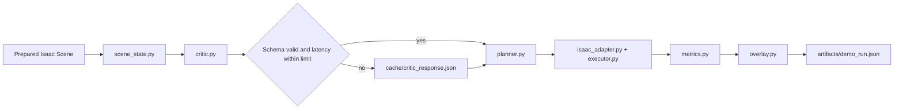

# rOCDbot Hackathon Demo Implementation Plan

## 1. Title and Metadata
- Project name: rOCDbot
- Version: 1.0
- Date: 2026-03-15
- Document ID: PLAN-ROCD-001
- Owners:
  - Product owner: hackathon core team
  - Technical owner: repository maintainers
  - Demo operator: assigned during Phase P05
- Current repository state:
  - Present at repo root: `.env`, `.env.example`, `.gitignore`, `AGENTS.md`, `LICENSE`, `prd.md`, `prd-old.md`, `firebase-debug.log`, `scripts/test_nebius_access.py`
  - Not present yet: `src/`, `tests/`, `assets/`, `cache/`, `artifacts/`, `plans/adrs/`
- Summary:
  - This document defines a standards-aligned, agile, agentic, iterative implementation plan for a simulation-first hackathon demo that fits within a 60-second live run and a 2-minute explanation. The target system is a deterministic Isaac-based tabletop correction episode in which a Unitree G1 identifies one obviously misaligned object, explains the violation via a Nebius text model, executes a pick-rotate-place correction, and renders before/after metrics with a verified fallback path when the model or network is unavailable.

## 2. Design Consensus and Trade-offs
- Topic: Demo embodiment
  - Verdict: FOR Unitree G1 in simulation
  - Rationale: The humanoid form supports the “robot restores order” story and aligns with the current PRD.
- Topic: Walking in the live path
  - Verdict: AGAINST
  - Rationale: A 1-minute judge demo needs deterministic success. Locomotion adds failure modes without proportional score gain for MVP.
- Topic: Fixed/reachable manipulation setup
  - Verdict: FOR
  - Rationale: Keeping the object already within reach reduces timing variance and enables repeatable pick-rotate-place behavior.
- Topic: Perception source
  - Verdict: FOR structured simulator state; AGAINST raw camera or VLM-first perception
  - Rationale: Simulator state is faster, cheaper, deterministic, and easier to debug for the hackathon MVP.
- Topic: Object selection
  - Verdict: FOR a textured rectangular object; AGAINST a plain cube
  - Rationale: Judges must see orientation change from a distance; a cube makes yaw hard to perceive.
- Topic: LLM role
  - Verdict: FOR high-level order critic and planner; AGAINST motor control by LLM
  - Rationale: Semantic reasoning is a good fit for Nebius text models; motion must remain deterministic and constrained.
- Topic: Nebius multimodal Kimi-K2.5 as a live dependency
  - Verdict: AGAINST for MVP
  - Rationale: Current repo smoke testing validates Nebius text access but the current Kimi-K2.5 vision path is not a stable dependency.
- Topic: Nebius text model for live critic
  - Verdict: FOR
  - Rationale: Existing repo smoke tests confirm stable text access through `scripts/test_nebius_access.py`.
- Topic: Scripted execution vs learned control
  - Verdict: FOR scripted or IK-based execution first
  - Rationale: The demo must work before training. Learned policies may be layered on later.
- Topic: RL as the critical path
  - Verdict: AGAINST
  - Rationale: RL is valuable for the 2-minute technical explanation, but BC/scripted execution is the lower-risk delivery path.
- Topic: Seeed SO-ARM101 + LeIsaac path
  - Verdict: AGAINST for this repository’s MVP
  - Rationale: That path shifts away from the G1 story, depends on older versions and a leader-arm hardware workflow, and does not lower demo risk for this repository.
- Topic: Demo scope
  - Verdict: FOR one object, one rule, one correction
  - Rationale: A single obvious disorder case is the highest-confidence path to a convincing 60-second run.

## 3. PRD

### 3.1 Problem
- Robots execute explicit tasks well but do not reliably notice subtle disorder such as a rotated object on a table.
- The demo must show that a robot can:
  - detect one order violation
  - explain why it is wrong
  - perform a physical correction

### 3.2 Users
- Primary users:
  - hackathon judges
  - live demo operator
  - engineering team members extending the demo

### 3.3 Value
- Demonstrates an agentic robotics pipeline rather than isolated motion.
- Shows a credible division of labor:
  - semantic judgment by LLM
  - deterministic action by robot controller

### 3.4 Business Goals
- Deliver a 1-minute demo with obvious visual change.
- Support a 2-minute technical explanation with enough substance to answer questions.
- Leave behind a reproducible repo structure for post-hackathon extension.

### 3.5 Success Metrics
- Demo wall-clock runtime: `<= 60 s`
- Action execution phase: `<= 45 s`
- Final yaw error: `<= 5 deg`
- Prepared-scene success rate across seeds `[7, 13, 23, 37, 41]`: `>= 95%`
- Nebius critic response or cached fallback selection: `100%`
- Artifact bundle creation per run: `100%`

### 3.6 Scope
- In scope:
  - one prepared tabletop scene
  - one textured rectangular object
  - one rule: align object to table axis
  - one live Nebius text reasoning call with fallback cache
  - one deterministic correction trajectory
  - one overlay with metrics and short rationale
- Out of scope:
  - full-room autonomy
  - raw camera-based perception in the live path
  - real robot deployment
  - live RL training
  - multi-object organization
  - locomotion as a required live step

### 3.7 Dependencies
- Repo-local:
  - `.env` with Nebius credentials
  - `.env.example`
  - `scripts/test_nebius_access.py`
- External:
  - Isaac Sim with RTX-capable hardware
  - Isaac Lab
  - Nebius Token Factory
  - Nebius CLI profile `rocdbot`

### 3.8 Risks
- GPU/driver incompatibility blocks Isaac runtime.
- Nebius latency or outage impacts the live critic.
- Object grasp or reorientation is unstable.
- Time lost on locomotion or multimodal scope creep.

### 3.9 Assumptions
- The demo is simulation-first.
- The prepared scene is acceptable for judging.
- The Nebius text path remains available; if not, cached fallback is allowed.
- The repository may be extended with `src/`, `tests/`, and `artifacts/`.

## 4. SRS

### 4.1 Functional Requirements
- REQ-001 | type: func | The system shall reset a prepared scene to a deterministic initial object pose and robot pose using a single command.
- REQ-002 | type: func | The system shall extract a structured scene state from the simulator containing object pose, target pose, table axis, and seed metadata.
- REQ-003 | type: func | The system shall request a Nebius text-model judgment over the structured scene state and require JSON output conforming to the documented critic schema.
- REQ-004 | type: func | The system shall use a cached critic response when Nebius is unavailable, slow, or returns invalid schema.
- REQ-005 | type: func | The system shall map the critic response into a supported primitive plan limited to approach, grasp, lift, rotate, place, and settle.
- REQ-006 | type: func | The system shall execute a prepared pick-rotate-place correction on the target object.
- REQ-007 | type: func | The system shall render a legible overlay showing the detected issue, selected plan, and before/after metrics.
- REQ-008 | type: func | The system shall provide a single demo entrypoint that orchestrates reset, reasoning, execution, scoring, and artifact writing.

### 4.2 Non-functional Requirements
- REQ-101 | type: perf | The full demo run shall complete in `<= 60 s` on supported hardware.
- REQ-102 | type: reliability | The full demo run shall succeed on at least `95%` of prepared seeds `[7, 13, 23, 37, 41]`.
- REQ-103 | type: nfr | Each run shall write a machine-readable artifact bundle containing input state, critic output, metrics, and error/fallback flags.
- REQ-104 | type: security | Secrets shall remain confined to `.env` or local profile state and shall not be introduced into committed source, fixtures, or artifacts.

### 4.3 Interfaces and APIs
- REQ-201 | type: int | `src/demo/critic.py` shall call the Nebius OpenAI-compatible chat completions API using the base URL in `.env` and a text-only model.
- REQ-202 | type: int | `src/demo/isaac_adapter.py` shall expose a stable internal contract for `reset_scene(seed)`, `read_scene_state()`, `execute_plan(plan)`, and `capture_frame(path)`.

### 4.4 Data Requirements
- REQ-301 | type: data | The run artifact JSON shall conform to a documented schema stored in the repository and versioned with the code.
- REQ-302 | type: data | Metric fields shall use explicit units: degrees for yaw, centimeters for planar position error, milliseconds for latency, and booleans for fallback flags.

### 4.5 Error and Telemetry Expectations
- REQ-401 | type: nfr | The system shall emit structured error codes and telemetry fields including `seed`, `fallback_used`, `error_code`, `critic_latency_ms`, `execution_latency_ms`, `yaw_before_deg`, `yaw_after_deg`, and `run_status`.
- Error codes:
  - `ERR_NEBIUS_TIMEOUT`
  - `ERR_NEBIUS_SCHEMA`
  - `ERR_RESET_NONDETERMINISTIC`
  - `ERR_EXECUTION_FAIL`
  - `ERR_ARTIFACT_WRITE`

### 4.6 Acceptance Criteria
- The operator can launch one command and complete a run without editing code.
- Judges can visually recognize the misalignment and the correction without narration.
- The system explains the correction in one short sentence and one short primitive plan.
- The before/after overlay shows a numerical improvement in yaw error.
- Cached fallback mode produces the same visible correction without internet dependence.

### 4.7 System Architecture Diagram


```
[Operator]
   |
   v
[scripts/run_demo.py]
   |
   +--> [src/demo/scene_state.py]
   +--> [src/demo/critic.py] ---> [Nebius Token Factory]
   +--> [src/demo/planner.py]
   +--> [src/demo/isaac_adapter.py]
   +--> [src/demo/executor.py]
   +--> [src/demo/metrics.py]
   +--> [src/demo/overlay.py]
   `--> [artifacts/<run-id>/]
```

## 5. Iterative Implementation and Test Plan

### 5.0 Phase Strategy
- Decompose by complexity and failure isolation:
  - P00: test harness and repo skeleton
  - P01: scene-state and metric contracts
  - P02: deterministic reset and scripted correction
  - P03: Nebius critic, planner, and fallback
  - P04: orchestrator, overlay, and artifact bundle
  - P05: reliability and performance hardening
  - P06: demo freeze, release assets, and rehearsal
- Verification-first policy:
  - every code-bearing phase starts with a failing test
  - the same command used in RED must be reused in GREEN
- Compute policy:
  - branch_limits: `1` active implementation branch and `1` optional spike branch
  - reflection_passes: `2` per phase; `+1` only when a phase gate is Red
  - early_stop%: pause a phase when more than `20%` of prepared-seed runs regress from the prior green baseline
- Governance:
  - any metric threshold change requires an ADR in `plans/adrs/`
- State safety:
  - create a restore-point tag before each phase transition using `git tag rp-pXX-green-<yyyymmddhhmm>`

### 5.1 Risk Register
- Risk: Isaac Sim does not run on target hardware
  - Trigger: startup failure or missing RTX features
  - Mitigation: validate hardware in P00; maintain a pre-recorded backup video by P06
- Risk: Nebius critic latency exceeds budget
  - Trigger: `critic_latency_ms > 2000` or API failure
  - Mitigation: cached fallback in P03 and prewarm request in P05
- Risk: Rotation correction is visually unclear
  - Trigger: judges cannot tell before vs after from one camera angle
  - Mitigation: use a textured rectangular object and target-axis overlay
- Risk: Grasp instability
  - Trigger: object slips or fails to settle
  - Mitigation: narrow to prepared pose, fixed grasp, fixed lift height, and scripted settle pose
- Risk: Scope creep
  - Trigger: work begins on walking, multimodal vision, or RL before MVP green
  - Mitigation: Phase exit gates block non-MVP work until P04 is green

### 5.2 Suspension and Resumption Criteria
- Suspend execution when:
  - `TEST-003` fails on two consecutive reruns
  - `TEST-006` fails for the canonical seed `7`
  - `EVAL-001` exceeds the runtime threshold on two consecutive runs
  - Nebius smoke check fails and fallback path is not yet green
- Resume only when:
  - the failing phase test is reproduced in RED
  - the fix is validated in GREEN
  - a new restore-point tag is created

### Phase P00: Quality Harness and Repository Skeleton
- Scope and objectives:
  - Establish executable test infrastructure and safe repository structure.
  - Impacted REQ-104.
- Iterative execution steps:
  - Step 1 (RED): Create/update `requirements-dev.txt`, `pytest.ini`, and `tests/unit/test_repo_contract.py` for REQ-104 with tag `# TEST-000` -> run `python3 -m pytest tests/unit/test_repo_contract.py -q -k TEST-000` -> expected: FAIL because required scaffold folders and ignore rules are absent.
  - Step 2 (GREEN): Create `src/demo/__init__.py`, `tests/unit/`, `tests/integration/`, `tests/fixtures/`, `assets/scenes/`, `cache/`, `artifacts/`, `plans/adrs/`; update `.gitignore` to exclude generated artifacts and caches -> run `python3 -m pytest tests/unit/test_repo_contract.py -q -k TEST-000` -> expected: PASS.
  - Step 3 (REFACTOR): Add `tests/conftest.py` and centralize repo-root path helpers -> run `python3 -m pytest tests/unit/test_repo_contract.py -q -k TEST-000` -> expected: PASS.
  - Step 4 (MEASURE): Run `EVAL_ID=EVAL-000 python3 scripts/test_nebius_access.py --skip-vision` -> expected: PASS and confirms existing Nebius text/cloud access.
- Exit gate rules:
  - Green: `TEST-000` and `EVAL-000` pass; restore-point tag created.
  - Yellow: `TEST-000` passes but Nebius smoke is flaky; proceed only with ADR for mandatory cached fallback.
  - Red: scaffold or secret-hygiene checks fail.
- Phase metrics:
  - Confidence %: 92. Local file creation with one external smoke check.
  - Long-term robustness %: 78. Establishes reusable repo hygiene and test layout.
  - Internal interactions: 4. Root, `src/`, `tests/`, `scripts/`.
  - External interactions: 1. Nebius smoke only.
  - Complexity %: 18. Low-complexity enablement work.
  - Feature creep %: 4. No product behavior introduced.
  - Technical debt %: 8. Minimal if completed in one pass.
  - YAGNI score: High. Only essential scaffolding.
  - MoSCoW: Must.
  - Local/Non-local scope: Mostly local.
  - Architectural changes count: 1. Repository skeleton introduced.

### Phase P01: Scene-State and Metrics Contracts
- Scope and objectives:
  - Define the canonical scene-state schema and metric functions independent of the simulator.
  - Impacted REQ-002, REQ-301, REQ-302, REQ-401.
- Iterative execution steps:
  - Step 1 (RED): Create/update `tests/unit/test_scene_state.py` for REQ-002 and REQ-301 with tag `# TEST-001` -> run `python3 -m pytest tests/unit/test_scene_state.py -q -k TEST-001` -> expected: FAIL because `src/demo/scene_state.py` and fixture schema do not exist.
  - Step 2 (GREEN): Implement `src/demo/scene_state.py` and add fixture files under `tests/fixtures/scene_state/` -> run `python3 -m pytest tests/unit/test_scene_state.py -q -k TEST-001` -> expected: PASS.
  - Step 3 (RED): Create/update `tests/unit/test_metrics.py` for REQ-302 and REQ-401 with tag `# TEST-002` -> run `python3 -m pytest tests/unit/test_metrics.py -q -k TEST-002` -> expected: FAIL because `src/demo/metrics.py` does not exist.
  - Step 4 (GREEN): Implement `src/demo/metrics.py` with explicit units and error-code fields -> run `python3 -m pytest tests/unit/test_metrics.py -q -k TEST-002` -> expected: PASS.
  - Step 5 (REFACTOR): Normalize fixture naming and schema validation helpers -> run `python3 -m pytest tests/unit/test_scene_state.py tests/unit/test_metrics.py -q -k 'TEST-001 or TEST-002'` -> expected: PASS.
  - Step 6 (MEASURE): Create `scripts/eval_demo.py` and run `python3 scripts/eval_demo.py --eval EVAL-003 --mode fixture --seed 7` -> expected: schema valid, metrics finite, and yaw delta for canonical fixture `>= 20 deg`.
- Exit gate rules:
  - Green: `TEST-001`, `TEST-002`, and `EVAL-003` pass.
  - Yellow: tests pass but fixture schema changes remain unstable; proceed only after ADR and fixture version bump.
  - Red: schema or metric units are ambiguous.
- Phase metrics:
  - Confidence %: 88. Pure-Python logic with controlled fixtures.
  - Long-term robustness %: 84. Contracts stabilize downstream phases.
  - Internal interactions: 5. `src/demo`, fixtures, tests, eval script, artifact schema.
  - External interactions: 0. No live network requirement.
  - Complexity %: 28. Moderate due to contract precision.
  - Feature creep %: 6. Narrow to one object schema.
  - Technical debt %: 12. Low if units are pinned now.
  - YAGNI score: High. Only schema and metrics required for MVP.
  - MoSCoW: Must.
  - Local/Non-local scope: Local.
  - Architectural changes count: 2. Introduces domain model and eval runner.

### Phase P02: Deterministic Reset and Scripted Correction
- Scope and objectives:
  - Implement the Isaac adapter, deterministic reset, and a fully scripted correction path that works without Nebius.
  - Impacted REQ-001, REQ-005, REQ-006, REQ-202.
- Iterative execution steps:
  - Step 1 (RED): Create/update `tests/integration/test_prepared_scene_reset.py` for REQ-001 and REQ-202 with tag `# TEST-003` -> run `python3 -m pytest tests/integration/test_prepared_scene_reset.py -q -k TEST-003` -> expected: FAIL because `src/demo/isaac_adapter.py` and prepared scene assets do not exist.
  - Step 2 (GREEN): Implement `src/demo/isaac_adapter.py` with `reset_scene(seed)` and `read_scene_state()`; add prepared scene assets under `assets/scenes/` -> run `python3 -m pytest tests/integration/test_prepared_scene_reset.py -q -k TEST-003` -> expected: PASS.
  - Step 3 (RED): Create/update `tests/integration/test_executor_sequence.py` for REQ-005 and REQ-006 with tag `# TEST-006` -> run `python3 -m pytest tests/integration/test_executor_sequence.py -q -k TEST-006` -> expected: FAIL because `src/demo/executor.py` does not exist.
  - Step 4 (GREEN): Implement `src/demo/executor.py` with a constrained primitive sequence and fixed grasp/rotate/place parameters -> run `python3 -m pytest tests/integration/test_executor_sequence.py -q -k TEST-006` -> expected: PASS.
  - Step 5 (REFACTOR): Remove duplicated adapter constants and centralize prepared-seed configuration -> run `python3 -m pytest tests/integration/test_prepared_scene_reset.py tests/integration/test_executor_sequence.py -q -k 'TEST-003 or TEST-006'` -> expected: PASS.
  - Step 6 (MEASURE): Run `python3 scripts/eval_demo.py --eval EVAL-002 --mode headless-scripted --seed 7` -> expected: final yaw error `<= 5 deg`, position error `<= 2 cm`, and action phase `<= 45 s`.
- Exit gate rules:
  - Green: scripted correction succeeds for seed `7` and integration tests pass.
  - Yellow: correction succeeds with minor metric misses; proceed only if backup video branch is started in parallel.
  - Red: reset is nondeterministic or executor cannot complete the correction.
- Phase metrics:
  - Confidence %: 74. First heavy simulator integration.
  - Long-term robustness %: 72. Scripted path remains useful as fallback even after learning.
  - Internal interactions: 6. Adapter, executor, assets, tests, evals, fixtures.
  - External interactions: 1. Isaac runtime only.
  - Complexity %: 56. Simulator and motion sequencing dominate risk.
  - Feature creep %: 10. Bounded if walking is excluded.
  - Technical debt %: 18. Some hard-coded poses acceptable for MVP.
  - YAGNI score: Medium-high. Scripted path is necessary for reliability.
  - MoSCoW: Must.
  - Local/Non-local scope: Mixed local and non-local.
  - Architectural changes count: 3. Adds runtime adapter, assets, and action layer.

### Phase P03: Nebius Critic, Planner, and Fallback
- Scope and objectives:
  - Introduce the Nebius critic, strict JSON contract validation, planner mapping, and cached fallback.
  - Impacted REQ-003, REQ-004, REQ-005, REQ-201, REQ-401.
- Iterative execution steps:
  - Step 1 (RED): Create/update `tests/unit/test_planner_contract.py` for REQ-003, REQ-005, and REQ-201 with tag `# TEST-004` -> run `python3 -m pytest tests/unit/test_planner_contract.py -q -k TEST-004` -> expected: FAIL because `src/demo/critic.py` and `src/demo/planner.py` do not exist.
  - Step 2 (GREEN): Implement `src/demo/critic.py` and `src/demo/planner.py` with strict schema validation and primitive whitelisting -> run `python3 -m pytest tests/unit/test_planner_contract.py -q -k TEST-004` -> expected: PASS.
  - Step 3 (RED): Create/update `tests/integration/test_critic_fallback.py` for REQ-004 and REQ-401 with tag `# TEST-005` -> run `python3 -m pytest tests/integration/test_critic_fallback.py -q -k TEST-005` -> expected: FAIL because cache selection and timeout behavior are missing.
  - Step 4 (GREEN): Add cache files under `cache/`, implement fallback routing, and emit structured fallback telemetry -> run `python3 -m pytest tests/integration/test_critic_fallback.py -q -k TEST-005` -> expected: PASS.
  - Step 5 (REFACTOR): Centralize prompt templates and response schema under `src/demo/contracts.py` -> run `python3 -m pytest tests/unit/test_planner_contract.py tests/integration/test_critic_fallback.py -q -k 'TEST-004 or TEST-005'` -> expected: PASS.
  - Step 6 (MEASURE): Run `python3 scripts/eval_demo.py --eval EVAL-004 --mode mocked-nebius --seed 7` -> expected: valid critic JSON in online mode and deterministic cache selection in injected-timeout mode.
- Exit gate rules:
  - Green: planner contract and fallback tests pass; mocked Nebius eval passes.
  - Yellow: online critic is flaky but fallback is stable; proceed with ADR documenting fallback-first live mode.
  - Red: planner emits unsupported primitives or fallback is not deterministic.
- Phase metrics:
  - Confidence %: 83. Mostly contract and error-handling work.
  - Long-term robustness %: 86. Fallback and schema validation reduce demo fragility.
  - Internal interactions: 7. Critic, planner, cache, contracts, tests, evals, env config.
  - External interactions: 2. Nebius API and local cache.
  - Complexity %: 42. Moderate due to API and fallback logic.
  - Feature creep %: 7. Text-only scope is bounded.
  - Technical debt %: 14. Acceptable if prompt template remains simple.
  - YAGNI score: High. Only order-critic behavior is added.
  - MoSCoW: Must.
  - Local/Non-local scope: Mixed local and non-local.
  - Architectural changes count: 2. Adds decision layer and cache path.

### Phase P04: Orchestrator, Overlay, and Artifact Bundle
- Scope and objectives:
  - Build the single-command demo runner, overlay, and machine-readable run artifacts.
  - Impacted REQ-007, REQ-008, REQ-103, REQ-301, REQ-401.
- Iterative execution steps:
  - Step 1 (RED): Create/update `tests/unit/test_overlay_payload.py` for REQ-007 with tag `# TEST-007` -> run `python3 -m pytest tests/unit/test_overlay_payload.py -q -k TEST-007` -> expected: FAIL because `src/demo/overlay.py` does not exist.
  - Step 2 (GREEN): Implement `src/demo/overlay.py` to format a short rationale, primitive list, and metric deltas -> run `python3 -m pytest tests/unit/test_overlay_payload.py -q -k TEST-007` -> expected: PASS.
  - Step 3 (RED): Create/update `tests/integration/test_demo_runner.py` for REQ-008, REQ-103, and REQ-301 with tag `# TEST-008` -> run `python3 -m pytest tests/integration/test_demo_runner.py -q -k TEST-008` -> expected: FAIL because `scripts/run_demo.py` and `src/demo/run_live.py` do not exist.
  - Step 4 (GREEN): Implement `src/demo/run_live.py` and `scripts/run_demo.py` with dry-run, mocked-Nebius, and live-Nebius modes -> run `python3 -m pytest tests/integration/test_demo_runner.py -q -k TEST-008` -> expected: PASS.
  - Step 5 (REFACTOR): Standardize run artifact paths under `artifacts/<run-id>/` and remove duplicated file naming logic -> run `python3 -m pytest tests/unit/test_overlay_payload.py tests/integration/test_demo_runner.py -q -k 'TEST-007 or TEST-008'` -> expected: PASS.
  - Step 6 (MEASURE): Run `python3 scripts/eval_demo.py --eval EVAL-005 --mode dry-run --seed 7` -> expected: artifact bundle exists, overlay payload is complete, and dry-run wall clock is `<= 60 s`.
- Exit gate rules:
  - Green: single-command dry-run works and artifacts are written.
  - Yellow: artifacts pass but overlay readability needs tuning; proceed only if readability changes do not alter contracts.
  - Red: no single-command entrypoint or no artifact bundle.
- Phase metrics:
  - Confidence %: 81. Mostly composition of prior green modules.
  - Long-term robustness %: 79. Artifact bundles support debugging and demos.
  - Internal interactions: 8. All demo modules plus artifacts.
  - External interactions: 1. Optional Nebius path during live mode.
  - Complexity %: 44. Orchestration and packaging complexity.
  - Feature creep %: 9. Overlay can attract non-essential polish work.
  - Technical debt %: 16. Moderate if artifact schema is not normalized.
  - YAGNI score: Medium-high. Runner and overlay are required for judging.
  - MoSCoW: Must.
  - Local/Non-local scope: Non-local.
  - Architectural changes count: 2. Adds orchestration and presentation layers.

### Phase P05: Reliability and Performance Hardening
- Scope and objectives:
  - Harden runtime, prewarm cold paths, and prove seed-level success and latency thresholds.
  - Impacted REQ-101, REQ-102, REQ-103, REQ-401.
- Iterative execution steps:
  - Step 1 (RED): Create/update `tests/perf/test_runtime_budget.py` for REQ-101 with tag `# TEST-009` -> run `python3 -m pytest tests/perf/test_runtime_budget.py -q -k TEST-009` -> expected: FAIL because runtime thresholds or perf harness are not yet enforced.
  - Step 2 (GREEN): Implement perf harness hooks in `scripts/eval_demo.py`, prewarm cache paths, and reduce startup variance -> run `python3 -m pytest tests/perf/test_runtime_budget.py -q -k TEST-009` -> expected: PASS.
  - Step 3 (RED): Create/update `tests/perf/test_prepared_seed_success.py` for REQ-102 with tag `# TEST-010` -> run `python3 -m pytest tests/perf/test_prepared_seed_success.py -q -k TEST-010` -> expected: FAIL because multi-seed reliability has not been demonstrated.
  - Step 4 (GREEN): Tune prepared poses, settle times, and timeout policy -> run `python3 -m pytest tests/perf/test_prepared_seed_success.py -q -k TEST-010` -> expected: PASS.
  - Step 5 (REFACTOR): Consolidate perf thresholds in one config module and remove duplicated constants -> run `python3 -m pytest tests/perf/test_runtime_budget.py tests/perf/test_prepared_seed_success.py -q -k 'TEST-009 or TEST-010'` -> expected: PASS.
  - Step 6 (MEASURE): Run `python3 scripts/eval_demo.py --eval EVAL-001 --mode live-or-cache --seeds 7 13 23 37 41` -> expected: total runtime `<= 60 s`, prepared-seed success `>= 95%`, and no unclassified error codes.
- Exit gate rules:
  - Green: both perf tests pass and `EVAL-001` is green.
  - Yellow: runtime is green but seed success is between `90%` and `95%`; proceed only if backup video is locked and ADR accepted.
  - Red: runtime or seed success falls below threshold.
- Phase metrics:
  - Confidence %: 69. Performance work exposes hidden simulator variance.
  - Long-term robustness %: 88. This phase directly determines demo survivability.
  - Internal interactions: 9. Cross-cuts nearly all modules.
  - External interactions: 2. Nebius and Isaac runtime.
  - Complexity %: 61. Timing and reliability tuning are inherently nonlinear.
  - Feature creep %: 6. Scope is constrained to threshold attainment.
  - Technical debt %: 20. Hard-coded warmup and timing knobs may remain.
  - YAGNI score: Medium. Necessary for live delivery.
  - MoSCoW: Must.
  - Local/Non-local scope: Non-local.
  - Architectural changes count: 1. Mostly tuning rather than new architecture.

### Phase P06: Demo Freeze, Backup Assets, and Rehearsal
- Scope and objectives:
  - Package the live demo, cache, and backup artifacts; prove the exact one-minute run and operator handoff.
  - Impacted REQ-004, REQ-008, REQ-103.
- Iterative execution steps:
  - Step 1 (RED): Create/update `tests/integration/test_release_manifest.py` for REQ-008 and REQ-103 with tag `# TEST-011` -> run `python3 -m pytest tests/integration/test_release_manifest.py -q -k TEST-011` -> expected: FAIL because release manifest and packaged assets do not exist.
  - Step 2 (GREEN): Implement `scripts/package_demo.py`, create `artifacts/release/demo_manifest.json`, and package cached critic response, canonical screenshot, and operator notes -> run `python3 -m pytest tests/integration/test_release_manifest.py -q -k TEST-011` -> expected: PASS.
  - Step 3 (REFACTOR): Remove duplicate packaging metadata and normalize release paths -> run `python3 -m pytest tests/integration/test_release_manifest.py -q -k TEST-011` -> expected: PASS.
  - Step 4 (MEASURE): Run `python3 scripts/eval_demo.py --eval EVAL-006 --mode release --seed 7` -> expected: release package complete, canonical live run under `60 s`, and cache-only mode successful.
- Exit gate rules:
  - Green: release manifest test passes, release eval passes, operator walkthrough completed.
  - Yellow: release package passes but narration timing exceeds `180 s`; proceed after rehearsal edits.
  - Red: release package incomplete or cache-only mode fails.
- Phase metrics:
  - Confidence %: 87. Mostly packaging and rehearsal once prior phases are green.
  - Long-term robustness %: 82. Freeze assets reduce presentation risk.
  - Internal interactions: 6. Packaging, artifacts, cached outputs, evals.
  - External interactions: 1. Optional live Nebius only.
  - Complexity %: 31. Lower technical complexity than P05.
  - Feature creep %: 3. Freeze phase should reject new features.
  - Technical debt %: 9. Packaging debt is acceptable if manifest is explicit.
  - YAGNI score: High. Freeze tasks are directly tied to successful judging.
  - MoSCoW: Must.
  - Local/Non-local scope: Mostly local.
  - Architectural changes count: 1. Release packaging only.

## 6. Evaluations
```yaml
evals:
  - id: EVAL-000
    purpose: dev
    metrics:
      - nebius_text_access
      - nebius_cloud_access
    thresholds:
      nebius_text_access: pass
      nebius_cloud_access: pass
    seeds: []
    runtime_budget: 2m
  - id: EVAL-001
    purpose: holdout
    metrics:
      - wall_clock_s
      - prepared_seed_success_rate
      - unclassified_error_count
    thresholds:
      wall_clock_s: <=60
      prepared_seed_success_rate: ">=0.95"
      unclassified_error_count: 0
    seeds: [7, 13, 23, 37, 41]
    runtime_budget: 20m
  - id: EVAL-002
    purpose: dev
    metrics:
      - yaw_after_deg
      - position_error_cm
      - action_phase_s
    thresholds:
      yaw_after_deg: <=5
      position_error_cm: <=2
      action_phase_s: <=45
    seeds: [7]
    runtime_budget: 5m
  - id: EVAL-003
    purpose: dev
    metrics:
      - scene_state_schema_valid
      - yaw_delta_deg
    thresholds:
      scene_state_schema_valid: pass
      yaw_delta_deg: ">=20"
    seeds: [7]
    runtime_budget: 1m
  - id: EVAL-004
    purpose: adv
    metrics:
      - critic_schema_valid
      - fallback_selected_on_timeout
    thresholds:
      critic_schema_valid: pass
      fallback_selected_on_timeout: pass
    seeds: [7]
    runtime_budget: 2m
  - id: EVAL-005
    purpose: dev
    metrics:
      - artifact_bundle_exists
      - dry_run_wall_clock_s
    thresholds:
      artifact_bundle_exists: pass
      dry_run_wall_clock_s: <=60
    seeds: [7]
    runtime_budget: 5m
  - id: EVAL-006
    purpose: holdout
    metrics:
      - release_manifest_complete
      - cache_only_success
      - canonical_run_s
    thresholds:
      release_manifest_complete: pass
      cache_only_success: pass
      canonical_run_s: <=60
    seeds: [7]
    runtime_budget: 10m
```

## 7. Tests

### 7.1 Test Inventory
- Actual runners currently present in the repository:
  - Infrastructure smoke script: `python3 scripts/test_nebius_access.py`
  - Infrastructure smoke script without vision check: `python3 scripts/test_nebius_access.py --skip-vision`
- Current file locations in repo:
  - `scripts/*.py`
- Current gaps:
  - No `tests/` directory exists yet.
  - No unit/integration/perf runner exists yet.
  - No `src/` module tree exists yet.
- Phase P00 introduces:
  - `pytest` as the formal test runner
  - a `tests/` tree
  - `requirements-dev.txt` and `pytest.ini`

### 7.2 Test Suites Overview
- Unit
  - Purpose: schema, metric, planner, and overlay logic
  - Runner: `pytest`
  - Command: `python3 -m pytest tests/unit -q`
  - Runtime budget: `<= 60 s`
  - Runs: pre-commit and CI
- Integration
  - Purpose: Isaac adapter, executor, fallback routing, artifact generation
  - Runner: `pytest`
  - Command: `python3 -m pytest tests/integration -q`
  - Runtime budget: `<= 10 m`
  - Runs: CI and before phase exit
- E2E
  - Purpose: full dry-run or cache/live demo path
  - Runner: `scripts/run_demo.py`
  - Command: `python3 scripts/run_demo.py --mode dry-run --seed 7`
  - Runtime budget: `<= 60 s`
  - Runs: before demo rehearsal and release
- Perf
  - Purpose: runtime and prepared-seed reliability
  - Runner: `pytest` plus `scripts/eval_demo.py`
  - Command: `python3 scripts/eval_demo.py --eval EVAL-001 --mode live-or-cache --seeds 7 13 23 37 41`
  - Runtime budget: `<= 20 m`
  - Runs: CI nightly and before release
- Data Drift
  - Purpose: protect fixture schema and prepared-scene invariants
  - Runner: `pytest` plus `scripts/eval_demo.py`
  - Command: `python3 scripts/eval_demo.py --eval EVAL-003 --mode fixture --seed 7`
  - Runtime budget: `<= 1 m`
  - Runs: pre-commit when scene fixtures change
- Static
  - Purpose: formatting, import sanity, and secret-hygiene checks
  - Runner: `pytest` for contract checks and `ruff` introduced in P00 if desired
  - Command: `python3 -m pytest tests/unit/test_repo_contract.py -q -k TEST-000`
  - Runtime budget: `<= 30 s`
  - Runs: pre-commit and CI

### 7.3 Test Definitions
- id: TEST-000
  - name: repo_scaffold_and_secret_hygiene
  - type: static
  - verifies: [REQ-104]
  - location: `tests/unit/test_repo_contract.py`
  - command: `python3 -m pytest tests/unit/test_repo_contract.py -q -k TEST-000`
  - fixtures/mocks/data: repository root, `.gitignore`, created folder tree
  - deterministic controls: no network; timeout `10 s`
  - pass_criteria: required directories exist and `.env` remains ignored
  - expected_runtime: `5 s`
- id: TEST-001
  - name: scene_state_schema_contract
  - type: unit
  - verifies: [REQ-002, REQ-301]
  - location: `tests/unit/test_scene_state.py`
  - command: `python3 -m pytest tests/unit/test_scene_state.py -q -k TEST-001`
  - fixtures/mocks/data: `tests/fixtures/scene_state/prepared_seed_7.json`
  - deterministic controls: seed `7`; no network; timeout `10 s`
  - pass_criteria: scene-state object validates against schema and contains required fields with correct units
  - expected_runtime: `5 s`
- id: TEST-002
  - name: metrics_unit_and_error_contract
  - type: unit
  - verifies: [REQ-302, REQ-401]
  - location: `tests/unit/test_metrics.py`
  - command: `python3 -m pytest tests/unit/test_metrics.py -q -k TEST-002`
  - fixtures/mocks/data: `tests/fixtures/scene_state/prepared_seed_7.json`, `tests/fixtures/scene_state/corrected_seed_7.json`
  - deterministic controls: seed `7`; no network; timeout `10 s`
  - pass_criteria: yaw, position, latency, and error-code fields are finite and unit-correct
  - expected_runtime: `5 s`
- id: TEST-003
  - name: prepared_scene_reset_determinism
  - type: integration
  - verifies: [REQ-001, REQ-202]
  - location: `tests/integration/test_prepared_scene_reset.py`
  - command: `python3 -m pytest tests/integration/test_prepared_scene_reset.py -q -k TEST-003`
  - fixtures/mocks/data: `assets/scenes/`, prepared-seed config, Isaac runtime
  - deterministic controls: seeds `7,13`; headless mode; timeout `180 s`
  - pass_criteria: repeated resets reproduce the same starting pose within tolerance
  - expected_runtime: `2 m`
- id: TEST-004
  - name: critic_and_planner_json_contract
  - type: unit
  - verifies: [REQ-003, REQ-005, REQ-201]
  - location: `tests/unit/test_planner_contract.py`
  - command: `python3 -m pytest tests/unit/test_planner_contract.py -q -k TEST-004`
  - fixtures/mocks/data: mocked Nebius JSON responses in `tests/fixtures/critic/`
  - deterministic controls: no live network; timeout `10 s`
  - pass_criteria: only whitelisted primitives are accepted and invalid JSON is rejected
  - expected_runtime: `5 s`
- id: TEST-005
  - name: critic_timeout_cache_fallback
  - type: integration
  - verifies: [REQ-004, REQ-401]
  - location: `tests/integration/test_critic_fallback.py`
  - command: `python3 -m pytest tests/integration/test_critic_fallback.py -q -k TEST-005`
  - fixtures/mocks/data: cached response file in `cache/`, mocked timeout response
  - deterministic controls: forced timeout mock; timeout `20 s`
  - pass_criteria: timeout or schema failure selects cache and emits fallback telemetry
  - expected_runtime: `10 s`
- id: TEST-006
  - name: scripted_executor_sequence
  - type: integration
  - verifies: [REQ-005, REQ-006, REQ-202]
  - location: `tests/integration/test_executor_sequence.py`
  - command: `python3 -m pytest tests/integration/test_executor_sequence.py -q -k TEST-006`
  - fixtures/mocks/data: prepared scene asset, canonical grasp/rotate/place parameters
  - deterministic controls: seed `7`; headless mode; timeout `180 s`
  - pass_criteria: executor completes the primitive sequence and reaches corrected pose tolerance
  - expected_runtime: `2 m`
- id: TEST-007
  - name: overlay_payload_legibility
  - type: unit
  - verifies: [REQ-007]
  - location: `tests/unit/test_overlay_payload.py`
  - command: `python3 -m pytest tests/unit/test_overlay_payload.py -q -k TEST-007`
  - fixtures/mocks/data: canonical before/after metric payload in `tests/fixtures/overlay/`
  - deterministic controls: no network; timeout `10 s`
  - pass_criteria: overlay text is concise, includes issue, plan, and metric delta fields
  - expected_runtime: `5 s`
- id: TEST-008
  - name: demo_runner_artifact_bundle
  - type: integration
  - verifies: [REQ-008, REQ-103, REQ-301, REQ-401]
  - location: `tests/integration/test_demo_runner.py`
  - command: `python3 -m pytest tests/integration/test_demo_runner.py -q -k TEST-008`
  - fixtures/mocks/data: dry-run mode, temp artifact directory
  - deterministic controls: seed `7`; mocked Nebius; timeout `120 s`
  - pass_criteria: one command produces a valid artifact bundle with required files and fields
  - expected_runtime: `1 m`
- id: TEST-009
  - name: runtime_budget_guard
  - type: perf
  - verifies: [REQ-101]
  - location: `tests/perf/test_runtime_budget.py`
  - command: `python3 -m pytest tests/perf/test_runtime_budget.py -q -k TEST-009`
  - fixtures/mocks/data: `scripts/eval_demo.py`, canonical seed list
  - deterministic controls: prepared seed `7`; warmup once; timeout `600 s`
  - pass_criteria: measured wall clock is at or below `60 s`
  - expected_runtime: `5 m`
- id: TEST-010
  - name: prepared_seed_success_guard
  - type: perf
  - verifies: [REQ-102]
  - location: `tests/perf/test_prepared_seed_success.py`
  - command: `python3 -m pytest tests/perf/test_prepared_seed_success.py -q -k TEST-010`
  - fixtures/mocks/data: prepared seeds `[7, 13, 23, 37, 41]`
  - deterministic controls: fixed seed set; timeout `1200 s`
  - pass_criteria: success rate across the prepared set is at or above `95%`
  - expected_runtime: `10 m`
- id: TEST-011
  - name: release_manifest_complete
  - type: integration
  - verifies: [REQ-008, REQ-103]
  - location: `tests/integration/test_release_manifest.py`
  - command: `python3 -m pytest tests/integration/test_release_manifest.py -q -k TEST-011`
  - fixtures/mocks/data: `artifacts/release/demo_manifest.json`, cached response file, canonical screenshot path
  - deterministic controls: no live network required; timeout `30 s`
  - pass_criteria: release manifest lists all required artifacts and every referenced file exists
  - expected_runtime: `10 s`
- Traceability tag requirement:
  - Every created or modified test file shall include grep-able tags such as `# TEST-001`.

### 7.4 Manual Checks
- CHECK-001
  - name: one_minute_judge_run
  - procedure:
    - Start the canonical scene using `python3 scripts/run_demo.py --mode release --seed 7`
    - Confirm visible wrong pose within `5 s`
    - Confirm rationale overlay appears before action begins
    - Confirm correction completes and freeze-frame occurs before `60 s`
    - Confirm operator can explain system architecture in `<= 120 s` using the release artifact bundle

## 8. Data Contract
- Artifact path:
  - `artifacts/<run-id>/demo_run.json`
- Schema snapshot:
```json
{
  "run_id": "20260315T220000Z-seed7",
  "seed": 7,
  "mode": "live-or-cache",
  "scene_state": {
    "object_id": "book_1",
    "table_axis_deg": 0.0,
    "yaw_before_deg": 28.0,
    "target_yaw_deg": 0.0,
    "position_error_before_cm": 1.5
  },
  "critic": {
    "source": "nebius|cache",
    "reason": "The object is rotated away from the table axis.",
    "plan": ["approach", "grasp", "lift", "rotate_to_target", "place", "settle"],
    "latency_ms": 640
  },
  "execution": {
    "status": "success",
    "execution_latency_ms": 18200
  },
  "metrics": {
    "yaw_after_deg": 2.0,
    "position_error_after_cm": 0.6,
    "order_score_before": 0.18,
    "order_score_after": 0.96
  },
  "fallback_used": false,
  "error_code": null
}
```
- Invariants:
  - `yaw_*_deg` values are numeric and finite
  - `plan` contains only whitelisted primitives
  - `fallback_used=true` implies `critic.source="cache"`
  - `error_code=null` implies `execution.status="success"`

## 9. Reproducibility
- Seeds:
  - canonical seed: `7`
  - prepared holdout seeds: `[13, 23, 37, 41]`
- Hardware:
  - Linux workstation or cloud workstation with RTX-capable GPU and RT cores
  - minimum target VRAM: `16 GB`
- Software:
  - Isaac Sim: pin at implementation time; target one supported RTX build only
  - Isaac Lab: pin at implementation time to match the Isaac Sim build
  - Nebius CLI: existing local profile `rocdbot`
  - Python: create and pin in `requirements-dev.txt`
- OS/driver/container tag:
  - Ubuntu Linux, NVIDIA driver compatible with the pinned Isaac Sim version
  - if containerized, record image tag in `artifacts/<run-id>/environment.json`

## 10. RTM
| Phase | REQ-### | TEST-### | Test Path | Command |
|---|---|---|---|---|
| P00 | REQ-104 | TEST-000 | `tests/unit/test_repo_contract.py` | `python3 -m pytest tests/unit/test_repo_contract.py -q -k TEST-000` |
| P01 | REQ-002 | TEST-001 | `tests/unit/test_scene_state.py` | `python3 -m pytest tests/unit/test_scene_state.py -q -k TEST-001` |
| P01 | REQ-301 | TEST-001 | `tests/unit/test_scene_state.py` | `python3 -m pytest tests/unit/test_scene_state.py -q -k TEST-001` |
| P01 | REQ-302 | TEST-002 | `tests/unit/test_metrics.py` | `python3 -m pytest tests/unit/test_metrics.py -q -k TEST-002` |
| P01 | REQ-401 | TEST-002 | `tests/unit/test_metrics.py` | `python3 -m pytest tests/unit/test_metrics.py -q -k TEST-002` |
| P02 | REQ-001 | TEST-003 | `tests/integration/test_prepared_scene_reset.py` | `python3 -m pytest tests/integration/test_prepared_scene_reset.py -q -k TEST-003` |
| P02 | REQ-202 | TEST-003 | `tests/integration/test_prepared_scene_reset.py` | `python3 -m pytest tests/integration/test_prepared_scene_reset.py -q -k TEST-003` |
| P03 | REQ-003 | TEST-004 | `tests/unit/test_planner_contract.py` | `python3 -m pytest tests/unit/test_planner_contract.py -q -k TEST-004` |
| P03 | REQ-005 | TEST-004 | `tests/unit/test_planner_contract.py` | `python3 -m pytest tests/unit/test_planner_contract.py -q -k TEST-004` |
| P03 | REQ-201 | TEST-004 | `tests/unit/test_planner_contract.py` | `python3 -m pytest tests/unit/test_planner_contract.py -q -k TEST-004` |
| P03 | REQ-004 | TEST-005 | `tests/integration/test_critic_fallback.py` | `python3 -m pytest tests/integration/test_critic_fallback.py -q -k TEST-005` |
| P03 | REQ-401 | TEST-005 | `tests/integration/test_critic_fallback.py` | `python3 -m pytest tests/integration/test_critic_fallback.py -q -k TEST-005` |
| P02 | REQ-006 | TEST-006 | `tests/integration/test_executor_sequence.py` | `python3 -m pytest tests/integration/test_executor_sequence.py -q -k TEST-006` |
| P02 | REQ-202 | TEST-006 | `tests/integration/test_executor_sequence.py` | `python3 -m pytest tests/integration/test_executor_sequence.py -q -k TEST-006` |
| P04 | REQ-007 | TEST-007 | `tests/unit/test_overlay_payload.py` | `python3 -m pytest tests/unit/test_overlay_payload.py -q -k TEST-007` |
| P04 | REQ-008 | TEST-008 | `tests/integration/test_demo_runner.py` | `python3 -m pytest tests/integration/test_demo_runner.py -q -k TEST-008` |
| P04 | REQ-103 | TEST-008 | `tests/integration/test_demo_runner.py` | `python3 -m pytest tests/integration/test_demo_runner.py -q -k TEST-008` |
| P04 | REQ-301 | TEST-008 | `tests/integration/test_demo_runner.py` | `python3 -m pytest tests/integration/test_demo_runner.py -q -k TEST-008` |
| P04 | REQ-401 | TEST-008 | `tests/integration/test_demo_runner.py` | `python3 -m pytest tests/integration/test_demo_runner.py -q -k TEST-008` |
| P05 | REQ-101 | TEST-009 | `tests/perf/test_runtime_budget.py` | `python3 -m pytest tests/perf/test_runtime_budget.py -q -k TEST-009` |
| P05 | REQ-102 | TEST-010 | `tests/perf/test_prepared_seed_success.py` | `python3 -m pytest tests/perf/test_prepared_seed_success.py -q -k TEST-010` |
| P06 | REQ-008 | TEST-011 | `tests/integration/test_release_manifest.py` | `python3 -m pytest tests/integration/test_release_manifest.py -q -k TEST-011` |
| P06 | REQ-103 | TEST-011 | `tests/integration/test_release_manifest.py` | `python3 -m pytest tests/integration/test_release_manifest.py -q -k TEST-011` |

## 11. Execution Log
- Phase Status: Pending/Done
- Completed Steps:
  - 
- Quantitative Results:
  - Metrics mean +/- std:
  - 95% CI:
- Issues/Resolutions:
  - 
- Failed Attempts:
  - 
- Deviations:
  - 
- Lessons Learned:
  - 
- ADR Updates:
  - 

## 12. Appendix: ADR Index
- ADR-001: Fixed/reachable G1 MVP; walking removed from the critical live path.
- ADR-002: Structured simulator state chosen over raw camera perception for MVP.
- ADR-003: Nebius text-only critic required; multimodal path excluded from live dependency.
- ADR-004: Scripted/IK execution required before any BC or RL work.
- ADR-005: Cached critic fallback is mandatory before live-demo freeze.
- ADR-006: Any metric threshold change requires written approval and RTM update.

## 13. Consistency Check
- RTM coverage:
  - All REQ IDs from `REQ-001` through `REQ-401` map to at least one concrete TEST with a file path and executable command.
- Phase metrics:
  - P00 through P06 each include populated phase metrics with rationale.
- Verification commands:
  - Every RED, GREEN, REFACTOR, and MEASURE step includes an explicit command containing a `TEST-###` selector or `EVAL-###` identifier.
