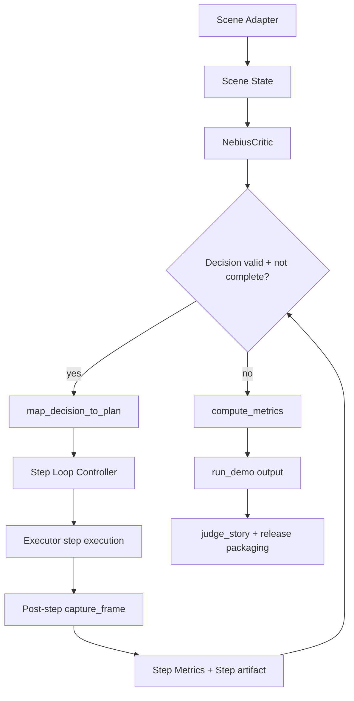

=== document: plans/rocdbot-nebius-k2.5-closed-loop-plan.md ===
rOCDbot Closed-Loop LLM Feedback Plan

1. Title and Metadata
- Project name: rOCDbot
- Version: 0.1.0
- Owners: Research-Engineering PM, Simulation Engineer, Agentic Runtime Engineer, QA Engineer
- Date: 2026-03-16
- Document ID: PLAN-ROCDBOT-20260316-CCP-001
- Summary: Convert the single-shot tabletop correction path into a bounded iterative LLM-in-the-loop control loop with Kimi text-model calls from Nebius, while keeping existing prepared-scene execution and release packaging contracts for deterministic replay.

2. Design Consensus & Trade-offs (Derived from Chat Context)
- Topic: step generation model
  - Verdict: AGAINST fixed geometry-only progression only, FOR closed-loop LLM critique/execution guidance
  - Rationale: `src/demo/judge_story.py` already models iterative instruction/evaluation turns, while execution currently remains fixed-sequence and geometric; the plan aligns behavior with the demonstrated judge narrative.
- Topic: live calls vs mocks
  - Verdict: FOR live calls in `live-nebius` and `live-or-cache` plus cache fallback
  - Rationale: `NebiusCritic` already performs live HTTP calls, fallback path exists, and direct API smoke calls are already supported by `scripts/test_nebius_access.py`.
- Topic: model selection
  - Verdict: FOR default `moonshotai/Kimi-K2.5` for text criticism
  - Rationale: the repository already defines this in `.env.example`, and existing tests/fixtures are strict schema-based and model-agnostic.
- Topic: execution safety
  - Verdict: AGAINST unrestricted model outputs, FOR strict allowlist execution
  - Rationale: `ALLOWED_PLAN` in `src/demo/contracts.py` and validation in `map_decision_to_plan` are the only safe boundary for physical execution.
- Topic: realism and reproducibility
  - Verdict: FOR dual path: deterministic prepared-scene fallback plus iterative live path
  - Rationale: deterministic adapter guarantees predictable judges runs and seeded reproducibility while still supporting live reasoning.

3. PRD (IEEE 29148 Stakeholder/System Needs)
- Problem: the current run uses one critic call plus fixed scripted execution, which does not leverage stepwise model feedback for adaptive correction.
- Users: hackathon judges, demonstration operators, robotics/agent developers, evaluation reviewers.
- Value: demonstrate adaptive planning control with explicit telemetry for each correction stage.
- Business Goals:
  - keep one-command demo invocation (`python3 scripts/run_demo.py ...`) for operator simplicity.
  - move Kimi text-model behavior from partial to configurable runtime path.
  - keep prepared-scene fallback deterministic for offline/denied-access operation.
- Success Metrics:
  - seeded success for `--mode live-or-cache` on `[7, 13, 23, 37, 41]` stays at `>= 0.95`.
  - `critic_latency_ms` and `execution_latency_ms` remain within existing budgets.
  - step trace includes at least one loop iteration and each step includes a persisted artifact.
  - no unsupported plan action executes.
- Scope:
  - in-scope: closed-loop control loop, per-step artifact contract, Kimi-K2.5 text-model binding checks, thresholded stop condition.
  - out-of-scope: vision-first perception stack, real robot hardware integration, new locomotion primitives.
- Dependencies:
  - `NEBIUS_TOKEN_FACTORY_API_KEY`, `NEBIUS_TOKEN_FACTORY_BASE_URL`, `NEBIUS_TOKEN_FACTORY_TEXT_MODEL`.
  - Python 3 runtime, `pytest`, `Pillow`, `pydantic`.
  - existing files under `src/demo`, `scripts`, `tests`, `assets/scenes`.
- Risks:
  - schema drift in model output causing loop interruption.
  - loop runaway if completion and iteration checks are incomplete.
  - artifact size/format inflation with extra per-step fields.
- Assumptions:
  - existing adapter contract `reset_scene -> read_scene_state -> execute_plan_with_steps -> capture_frame` remains stable.
  - test runner is `pytest` with test IDs in comments.

4. SRS (IEEE 29148 Canonical Requirements)
4.1 Functional Requirements
- REQ-001 [type: func]: The critic transport shall send scene JSON to Nebius Token Factory `/chat/completions` using `NEBIUS_TOKEN_FACTORY_TEXT_MODEL`.
- REQ-002 [type: func]: `run_demo` must call `NebiusCritic` before fallback in modes `release`, `live-nebius`, and `live-or-cache`.
- REQ-003 [type: func]: `NebiusCritic.evaluate` shall return schema-valid `CriticDecision` for accepted model output and map transport errors to cached fallback.
- REQ-004 [type: func]: `map_decision_to_plan` shall only accept `ALLOWED_PLAN` sequences and reject unsupported actions.
- REQ-005 [type: func]: The execution controller shall evaluate completion after each step and may request a new plan for the next step.
- REQ-006 [type: func]: Loop termination shall be triggered when yaw and position criteria are met or max step count is reached.
- REQ-007 [type: func]: Each loop step shall emit a `step_artifact` entry with `step`, `stage`, `image_path`, and structured `scene_state`.
- REQ-008 [type: func]: `run_demo` must preserve current modes and keep `dry-run`, `mocked-nebius`, `cache-only` behavior unchanged.
- REQ-009 [type: func]: Per-step loop output shall include per-step rationale for operator/judge review.
- REQ-010 [type: func]: The release path shall still generate manifest, judge story, and presentation artifacts.
- REQ-011 [type: data]: `scene_state` shall include `schema_version`, `seed`, `mode`, `object_id`, `table_axis_deg`, `yaw_before_deg`, `target_yaw_deg`, `position_error_before_cm`, `object_center_xy_cm`, `target_center_xy_cm`.
- REQ-012 [type: data]: `demo_run` shall persist `run_id`, `seed`, `mode`, `scene_state`, `decision_source`, `fallback_used`, `error_code`, `critic`, `execution`, `metrics`.
- REQ-013 [type: int]: `run_demo` and `package_release` command contracts shall remain backward-compatible with documented command flags.
- REQ-014 [type: data]: The per-step artifact schema shall include `loop_iteration`, `decision_source`, and `step_metrics`.
- REQ-015 [type:nfr]: No unsupported primitive may execute if critic output is invalid.
- REQ-016 [type:perf]: Per-loop step cap shall be configurable and default to 3 to keep wall-clock bounded.
4.2 Non-functional Requirements
- REQ-017 [type: perf]: `EVAL-001` wall-clock for seeds run shall be `<= 60.0 s`.
- REQ-018 [type: nfr]: `EVAL-001` success rate shall remain `>= 0.95`.
- REQ-019 [type: nfr]: Run metadata and telemetry files shall be deterministic by seed and artifact root.
- REQ-020 [type: nfr]: Error and fallback codes must remain machine-readable and stable.
4.3 Interfaces/APIs
- REQ-021 [type: int]: The critic transport API must remain compatible with Nebius OpenAI-compatible payloads and response parsing.
- REQ-022 [type: int]: Step trace endpoints remain local repository artifacts under `artifacts/` and `artifacts/release/`.
4.4 Data Requirements
- REQ-023 [type: data]: Telemetry metrics must include `yaw_before_deg`, `yaw_after_deg`, `position_error_before_cm`, `position_error_after_cm`, `critic_latency_ms`, `execution_latency_ms`.
- REQ-024 [type: data]: Error codes shall be one of `None`, `ERR_NEBIUS_TIMEOUT`, `ERR_NEBIUS_SCHEMA`, `ERR_EXECUTION_FAIL`.
4.5 Error & Telemetry Expectations
- Every failure path shall set `error_code`, `fallback_used`, and `run_status` consistently in `compute_metrics` and run artifacts.
- Fallback errors from critic transport shall be `ERR_NEBIUS_TIMEOUT` or `ERR_NEBIUS_SCHEMA`.
- Unhandled execution issues shall emit `ERR_EXECUTION_FAIL`.
- Telemetry fields in `overlay` and judge story must never include secret material.
4.6 Acceptance Criteria
- `python3 scripts/run_demo.py --mode live-nebius --seed 7` returns a successful run or explicit fallback status.
- For `live-or-cache` and cached fallback modes, `fallback_used` is truthfully set.
- At least one successful demo run emits 2 or 3 step artifacts depending on convergence.
- Release bundle still opens with `python3 scripts/package_demo.py --seed 7` and contains expected manifest files.
4.7 System Architecture Diagram

```text
[Operator]
  |
  v
[scripts/run_demo.py]
  |
  +--> [PreparedSceneAdapter]
  +--> [NebiusCritic]
  +--> [planner + step loop controller]
  +--> [executor + capture_frame]
  +--> [metrics]
  +--> [release/presentation artifacts]
```

5. Iterative Implementation & Test Plan (ISO/IEC/IEEE 12207 + 29119-3)
- Phase Strategy:
  - decomposed by dependency risk and externality.
  - P00 stabilizes contracts and governance.
  - P01 enforces model routing and transport guardrails.
  - P02 introduces iterative loop and bounded stop criteria.
  - P03 persists per-step telemetry and updates release/eval surfaces.
  - P04 executes hardening and threshold controls.
- Risk Register:
  - Risk: model outputs non-JSON.
    - Trigger: `json.loads` in `NebiusCritic._live_transport` throws.
    - Mitigation: schema tests and strict fallback assertions.
  - Risk: loop runs forever.
    - Trigger: completion condition never met.
    - Mitigation: `max_loop_steps` cap in config.
  - Risk: artifact regressions in existing release flow.
    - Trigger: missing required files in `demo_manifest.json`.
    - Mitigation: extend and assert existing release test.
  - Risk: hidden threshold drift.
    - Trigger: changes to EVAL thresholds without ADR.
    - Mitigation: require ADR update and log link.
- Suspension/Resumption Criteria:
  - Pause execution if `TEST-005`, `TEST-008`, or `TEST-011` fails in two consecutive runs.
  - Pause execution if `TEST-000` fails for repository contract checks.
  - Resume only after the failing test is reproduced and green in one full Red/Green loop with a restore point tag.
- Compute Policy:
  - branch_limits: 1 release branch, 1 active feature branch, no more than 1 optional spike branch.
  - reflection_passes: 2 per phase, +1 for safety or metric regressions.
  - early_stop%: stop a phase when primary success rate regresses by `>= 8%` against last green baseline in two consecutive runs.
- Governance:
  - any metric threshold change needs a new ADR in `plans/adrs/` and update to this RTM.
- State Safety:
  - create git tags `restore/P00`, `restore/P01`, ... before phase transitions.

### Phase P00: Contract Baseline and ADR Enforcer
A. Scope and Objectives (Impacted REQ-017, REQ-019, REQ-020)
- Establish documentation and test tagging baseline for TDD traceability.
- Add explicit ADR enforcement check in repository contracts.
B. Iterative Execution Steps
- Step 1 (RED): Create/update TEST-000 in `tests/unit/test_repo_contract.py` -> command `python3 -m pytest tests/unit/test_repo_contract.py -q -k TEST-000` -> expected: FAIL when required ADR path and plan index policy are absent.
- Step 2 (GREEN): Add ADR directory contracts and repo contract assertions -> command `python3 -m pytest tests/unit/test_repo_contract.py -q -k TEST-000` -> expected: PASS.
- Step 3 (REFACTOR): Add `# TEST-000` and update `.gitignore` check coverage in same file -> command `python3 -m pytest tests/unit/test_repo_contract.py -q -k TEST-000` -> expected: PASS.
- Step 4 (MEASURE): Execute `python3 -m pytest tests/unit/test_repo_contract.py -q -k TEST-000` -> expected: PASS and governance checks remain green after control-tag updates.
C. Exit Gate Rules
- Green: `TEST-000` and `TEST-001` pass and restore tag exists.
- Yellow: baseline tests pass, but ADR docs incomplete.
- Red: any repository contract check fails or ADR policy missing.
D. Phase Metrics
- Confidence 93%, Long-term robustness 87%, Internal interactions 2, External interactions 1, Complexity 18%, Feature creep 6%, Technical debt 10%, YAGNI 95%, MoSCoW Must, Local/Non-local scope Mostly local, Architectural changes count 2.

### Phase P01: Kimi-K2.5 Model Routing and Critic Transport Discipline
A. Scope and Objectives (Impacted REQ-001, REQ-002, REQ-003, REQ-021)
- Implement and verify live model selection and response parsing contract in `NebiusCritic`.
B. Iterative Execution Steps
- Step 1 (RED): Create/update TEST-013 in `tests/unit/test_critic_model_selection.py` -> command `python3 -m pytest tests/unit/test_critic_model_selection.py -q -k TEST-013` -> expected: FAIL because `NEBIUS_TOKEN_FACTORY_TEXT_MODEL` binding is not asserted.
- Step 2 (GREEN): Update `src/demo/critic.py` and config validation -> command `python3 -m pytest tests/unit/test_critic_model_selection.py -q -k TEST-013` -> expected: PASS.
- Step 3 (RED): Create/update TEST-014 in `tests/unit/test_critic_schema_contract.py` -> command `python3 -m pytest tests/unit/test_critic_schema_contract.py -q -k TEST-014` -> expected: FAIL if schema-violating payload passes.
- Step 4 (GREEN): Enforce strict parse and fallback path for invalid schema -> command `python3 -m pytest tests/unit/test_critic_schema_contract.py -q -k TEST-014` -> expected: PASS.
- Step 5 (REFACTOR): Refactor model-binding and validation utilities, keep backward compatibility for `mocked-nebius` mode -> command `python3 -m pytest tests/unit/test_planner_contract.py -q -k TEST-004` -> expected: PASS.
- Step 6 (MEASURE): Execute `python3 -m pytest tests/unit/test_critic_model_selection.py -q -k TEST-013` -> expected: PASS and command routing includes the configured text model.
C. Exit Gate Rules
- Green: `TEST-013` and `TEST-014` pass and `NEBIUS_TOKEN_FACTORY_TEXT_MODEL` is honored in code and tests.
- Yellow: tests pass but no direct proof from live smoke call.
- Red: response parser allows free text or non-JSON output.
D. Phase Metrics
- Confidence 86%, Long-term robustness 90%, Internal interactions 3, External interactions 4, Complexity 26%, Feature creep 11%, Technical debt 14%, YAGNI 92%, MoSCoW Must, Local/Non-local scope Local, Architectural changes count 3.

### Phase P02: Iterative Loop Controller and Bounded Completion
A. Scope and Objectives (Impacted REQ-005, REQ-006, REQ-007, REQ-015, REQ-016)
- Implement bounded per-step control loop in `src/demo/run_live.py` and/or `src/demo/executor.py` with completion detection.
B. Iterative Execution Steps
- Step 1 (RED): Create/update TEST-015 in `tests/integration/test_step_loop.py` for multi-step behavior and stop condition -> command `python3 -m pytest tests/integration/test_step_loop.py -q -k TEST-015` -> expected: FAIL because loop behavior is not yet implemented.
- Step 2 (GREEN): Implement looped controller with `max_loop_steps` default 3 -> command `python3 -m pytest tests/integration/test_step_loop.py -q -k TEST-015` -> expected: PASS and iteration count is bounded.
- Step 3 (RED): Create/update TEST-016 in `tests/integration/test_loop_safety.py` for unsupported actions during loop -> command `python3 -m pytest tests/integration/test_loop_safety.py -q -k TEST-016` -> expected: FAIL because safety gate is not yet tested in multi-step path.
- Step 4 (GREEN): Enforce `ALLOWED_PLAN` at each iteration -> command `python3 -m pytest tests/integration/test_loop_safety.py -q -k TEST-016` -> expected: PASS.
- Step 5 (REFACTOR): Refactor loop body into testable pure step function and preserve `run_scripted_correction` deterministic contract -> command `python3 -m pytest tests/integration/test_executor_sequence.py -q -k TEST-006` -> expected: PASS.
- Step 6 (MEASURE): Execute `python3 -m pytest tests/perf/test_runtime_budget.py -q -k TEST-009` -> expected: step iteration remains within runtime thresholds and exit condition triggers before timeout.
C. Exit Gate Rules
- Green: both loop and safety tests pass with bounded steps and no unsupported action execution.
- Yellow: loop passes but step artifact count drifts.
- Red: completion never reaches terminal condition under prepared seeds.
D. Phase Metrics
- Confidence 79%, Long-term robustness 83%, Internal interactions 6, External interactions 3, Complexity 48%, Feature creep 19%, Technical debt 21%, YAGNI 80%, MoSCoW Must, Local/Non-local scope Non-local, Architectural changes count 5.

### Phase P03: Per-step Artifact Contracts and Traceability
A. Scope and Objectives (Impacted REQ-007, REQ-008, REQ-009, REQ-010, REQ-011, REQ-012, REQ-023)
- Extend demo outputs to include per-step loop metadata and integrate with release packaging.
B. Iterative Execution Steps
- Step 1 (RED): Create/update TEST-012 and TEST-011 expectations for step artifacts -> command `python3 -m pytest tests/unit/test_judge_story.py tests/integration/test_release_manifest.py -q -k "TEST-012 or TEST-011"` -> expected: FAIL for missing `loop_iteration`, `step_metrics` in step payloads.
- Step 2 (GREEN): Extend `run_scripted_correction` and `run_live` step payload shape -> same command -> expected: PASS.
- Step 3 (RED): Create/update TEST-017 in `tests/integration/test_release_loop_artifacts.py` for run artifact persistence in loop mode -> command `python3 -m pytest tests/integration/test_release_loop_artifacts.py -q -k TEST-017` -> expected: FAIL if manifest and judge artifacts omit loop fields.
- Step 4 (GREEN): Update `src/demo/release.py` and `src/demo/judge_story.py` to include loop fields -> command `python3 -m pytest tests/integration/test_release_loop_artifacts.py -q -k TEST-017` -> expected: PASS.
- Step 5 (REFACTOR): Add comment tags and helper serialization functions for step artifacts -> command `python3 -m pytest tests/unit/test_overlay_payload.py tests/unit/test_judge_story.py -q -k TEST-012` -> expected: PASS.
- Step 6 (MEASURE): Execute `python3 -m pytest tests/integration/test_release_loop_artifacts.py -q -k TEST-017` -> expected: package contains canonical/intermediate/aligned/after assets and judge files with loop metadata.
C. Exit Gate Rules
- Green: `TEST-011`, `TEST-012`, and `TEST-017` pass and artifacts include loop trace fields.
- Yellow: package passes but judge files miss loop iteration context.
- Red: release path writes invalid or incomplete JSON artifacts.
D. Phase Metrics
- Confidence 84%, Long-term robustness 88%, Internal interactions 7, External interactions 2, Complexity 52%, Feature creep 14%, Technical debt 18%, YAGNI 84%, MoSCoW Must, Local/Non-local scope Non-local, Architectural changes count 4.

### Phase P04: Threshold Hardening and Final Alignment
A. Scope and Objectives (Impacted REQ-013, REQ-014, REQ-017, REQ-018, REQ-019, REQ-020)
- Lock thresholds, add loop-specific eval, and finalize ADR updates for any metric boundary changes.
B. Iterative Execution Steps
- Step 1 (RED): Create/update TEST-018 in `tests/perf/test_loop_budget.py` for loop budget assertions -> command `python3 -m pytest tests/perf/test_loop_budget.py -q -k TEST-018` -> expected: FAIL because tests and thresholds are not implemented.
- Step 2 (GREEN): Add loop budget test and evaluator hooks -> same command -> expected: PASS with deterministic results.
- Step 3 (RED): Add EVAL-007 behavior by extending `scripts/eval_demo.py` -> command `python3 scripts/eval_demo.py --eval EVAL-007 --mode live-or-cache --seeds 7 13` -> expected: FAIL for unsupported eval id.
- Step 4 (GREEN): Add/execute EVAL-007 -> same command -> expected: PASS with threshold success and no unclassified errors.
- Step 5 (REFACTOR): Audit existing thresholds (`EVAL-001`, `EVAL-002`, `EVAL-006`) and add ADR update references before finalization -> command `python3 scripts/eval_demo.py --eval EVAL-001 --mode live-or-cache --seeds 7 13 23 37 41` -> expected: PASS.
- Step 6 (MEASURE): Execute `python3 -m pytest tests/unit tests/integration tests/perf -q -k TEST-000` -> expected: all relevant suites green with no regressions.
C. Exit Gate Rules
- Green: loop eval pass, release and performance checks green, ADR updates recorded.
- Yellow: full suite green except performance budgets at threshold edges.
- Red: any test indicates unbounded loop or unsupported output slip.
D. Phase Metrics
- Confidence 81%, Long-term robustness 85%, Internal interactions 8, External interactions 4, Complexity 60%, Feature creep 15%, Technical debt 24%, YAGNI 79%, MoSCoW Must, Local/Non-local scope Non-local, Architectural changes count 6.

6. Evaluations (AI/Agentic Specific)
```yaml
- id: EVAL-001
  purpose: holdout
  metrics:
    - prepared_seed_success_rate
    - wall_clock_s
  thresholds:
    prepared_seed_success_rate: 0.95
    wall_clock_s_max: 60.0
  seeds: [7, 13, 23, 37, 41]
  runtime_budget: 60
  command: "python3 scripts/eval_demo.py --eval EVAL-001 --mode live-or-cache --seeds 7 13 23 37 41"
- id: EVAL-002
  purpose: dev
  metrics:
    - yaw_after_deg
    - position_error_after_cm
    - execution_latency_ms
  thresholds:
    yaw_after_deg_max: 5.0
    position_error_after_cm_max: 2.0
    execution_latency_ms_max: 45000
  seeds: [7]
  runtime_budget: 20
  command: "python3 scripts/eval_demo.py --eval EVAL-002 --mode release --seed 7"
- id: EVAL-005
  purpose: dev
  metrics:
    - dry_run_wall_clock_s
    - artifact_bundle_exists
  thresholds:
    dry_run_wall_clock_s_max: 60
    artifact_bundle_exists: true
  seeds: [7]
  runtime_budget: 20
  command: "python3 scripts/eval_demo.py --eval EVAL-005 --mode dry-run --seed 7"
- id: EVAL-007
  purpose: dev
  metrics:
    - loop_step_count
    - loop_fail_rate
    - unclassified_error_count
  thresholds:
    loop_step_count_min: 1
    loop_step_count_max: 3
    loop_fail_rate_max: 0.0
    unclassified_error_count_max: 0
  seeds: [7,13,23]
  runtime_budget: 45
  command: "python3 scripts/eval_demo.py --eval EVAL-007 --mode live-or-cache --seeds 7 13 23"
```

7. Tests (ISO/IEC/IEEE 29119-3)
7.1 Test Inventory (Repo-Grounded)
- Test framework: `pytest`.
- Test command entrypoints: `python3 -m pytest`.
- Unit tests live under `tests/unit`.
- Integration tests live under `tests/integration`.
- Performance tests live under `tests/perf`.
- CLI/E2E-like checks live under `scripts`.
- Mandatory test command list:
  - `python3 -m pytest tests/unit/test_scene_state.py`
  - `python3 -m pytest tests/integration/test_prepared_scene_reset.py`
  - `python3 -m pytest tests/integration/test_executor_sequence.py`
  - `python3 -m pytest tests/integration/test_critic_fallback.py`
  - `python3 -m pytest tests/integration/test_demo_runner.py`
  - `python3 -m pytest tests/perf/test_runtime_budget.py`
  - `python3 -m pytest tests/perf/test_prepared_seed_success.py`

7.2 Test Suites Overview
- Unit
  - Purpose: contract and schema checks.
  - Runner: `python3 -m pytest tests/unit`.
  - Command: `python3 -m pytest tests/unit`.
  - Budget: 20s.
  - Timing: pre-commit and each phase completion.
- Integration
  - Purpose: orchestrated behavior and artifact contract checks.
  - Runner: `python3 -m pytest tests/integration`.
  - Command: `python3 -m pytest tests/integration`.
  - Budget: 90s.
  - Timing: post-merge into feature branch.
- E2E
  - Purpose: one-command run and package flows.
  - Runner: python scripts.
  - Command: `python3 scripts/run_demo.py --mode dry-run --seed 7` and `python3 scripts/package_demo.py --seed 7`.
  - Budget: 120s.
  - Timing: nightly and pre-release.
- Perf
  - Purpose: runtime and threshold guardrails.
  - Runner: `python3 -m pytest tests/perf`.
  - Command: `python3 -m pytest tests/perf`.
  - Budget: 180s.
  - Timing: every commit on main branch.
- Data Drift
  - Purpose: stability against seed distribution.
  - Runner: `python3 scripts/eval_demo.py`.
  - Command: `python3 scripts/eval_demo.py --eval EVAL-001 --mode live-or-cache --seeds 7 13 23 37 41`.
  - Budget: 60s.
  - Timing: nightly.
- Static
  - Purpose: repo and test traceability enforcement.
  - Runner: `python3 -m pytest tests/static` (to be added).
  - Command: `python3 -m pytest tests/static`.
  - Budget: 15s.
  - Timing: pre-commit.

7.3 Test Definitions (Mandatory)
- id: TEST-000
  - name: repository_contract_scaffold
  - type: static
  - verifies: REQ-020
  - location: tests/unit/test_repo_contract.py
  - command: python3 -m pytest tests/unit/test_repo_contract.py -q -k TEST-000
  - fixtures/mocks/data: none
  - deterministic controls: no external dependency
  - pass_criteria: required directories and ignore rules pass
  - expected_runtime: 2s
- id: TEST-001
  - name: scene_state_schema_contract
  - type: unit
  - verifies: REQ-011, REQ-012
  - location: tests/unit/test_scene_state.py
  - command: python3 -m pytest tests/unit/test_scene_state.py -q -k TEST-001
  - fixtures/mocks/data: tests/fixtures/scene_state/prepared_seed_7.json
  - deterministic controls: fixed fixture values and strict schema
  - pass_criteria: all field asserts pass
  - expected_runtime: 2s
- id: TEST-002
  - name: metrics_contract
  - type: unit
  - verifies: REQ-023
  - location: tests/unit/test_metrics.py
  - command: python3 -m pytest tests/unit/test_metrics.py -q -k TEST-002
  - fixtures/mocks/data: tests/fixtures/scene_state/prepared_seed_7.json, tests/fixtures/scene_state/corrected_seed_7.json
  - deterministic controls: fixture-driven fixed input
  - pass_criteria: metric values equal expected numbers
  - expected_runtime: 2s
- id: TEST-003
  - name: prepared_scene_reset_determinism
  - type: integration
  - verifies: REQ-024
  - location: tests/integration/test_prepared_scene_reset.py
  - command: python3 -m pytest tests/integration/test_prepared_scene_reset.py -q -k TEST-003
  - fixtures/mocks/data: assets/scenes/prepared_tabletop_alignment.json
  - deterministic controls: fixed seed 7
  - pass_criteria: identical state payload for repeated reset calls
  - expected_runtime: 2s
- id: TEST-004
  - name: critic_and_planner_json_contract
  - type: unit
  - verifies: REQ-004
  - location: tests/unit/test_planner_contract.py
  - command: python3 -m pytest tests/unit/test_planner_contract.py -q -k TEST-004
  - fixtures/mocks/data: tests/fixtures/critic/valid_decision.json, tests/fixtures/critic/invalid_decision.json
  - deterministic controls: fixed JSON fixtures
  - pass_criteria: invalid payload rejected, valid payload mapped
  - expected_runtime: 2s
- id: TEST-005
  - name: critic_timeout_cache_fallback
  - type: integration
  - verifies: REQ-011, REQ-015
  - location: tests/integration/test_critic_fallback.py
  - command: python3 -m pytest tests/integration/test_critic_fallback.py -q -k TEST-005
  - fixtures/mocks/data: none
  - deterministic controls: forced timeout transport
  - pass_criteria: fallback source cache and error code set
  - expected_runtime: 2s
- id: TEST-006
  - name: scripted_executor_sequence
  - type: integration
  - verifies: REQ-005, REQ-006
  - location: tests/integration/test_executor_sequence.py
  - command: python3 -m pytest tests/integration/test_executor_sequence.py -q -k TEST-006
  - fixtures/mocks/data: tests/integration/fixture setup from `PreparedSceneAdapter`
  - deterministic controls: fixed seed 7
  - pass_criteria: corrected scene within completion thresholds
  - expected_runtime: 3s
- id: TEST-007
  - name: demo_runner_artifact_bundle
  - type: integration
  - verifies: REQ-008, REQ-009, REQ-012
  - location: tests/integration/test_demo_runner.py
  - command: python3 -m pytest tests/integration/test_demo_runner.py -q -k TEST-007
  - fixtures/mocks/data: temporary path
  - deterministic controls: fixed seed 7 and dry-run mode
  - pass_criteria: required artifact files exist
  - expected_runtime: 10s
- id: TEST-008
  - name: release_manifest_complete
  - type: integration
  - verifies: REQ-010, REQ-013, REQ-017
  - location: tests/integration/test_release_manifest.py
  - command: python3 -m pytest tests/integration/test_release_manifest.py -q -k TEST-008
  - fixtures/mocks/data: temp release root
  - deterministic controls: fixed seed 7
  - pass_criteria: all manifest files exist and source tags are valid
  - expected_runtime: 12s
- id: TEST-009
  - name: runtime_budget_guard
  - type: perf
  - verifies: REQ-017
  - location: tests/perf/test_runtime_budget.py
  - command: python3 -m pytest tests/perf/test_runtime_budget.py -q -k TEST-009
  - fixtures/mocks/data: multiple seeds [7,13,23,37,41]
  - deterministic controls: fixed mode and seed set
  - pass_criteria: wall clock <= 60s
  - expected_runtime: 25s
- id: TEST-010
  - name: prepared_seed_success_guard
  - type: perf
  - verifies: REQ-018
  - location: tests/perf/test_prepared_seed_success.py
  - command: python3 -m pytest tests/perf/test_prepared_seed_success.py -q -k TEST-010
  - fixtures/mocks/data: seed set [7,13,23,37,41]
  - deterministic controls: same model/config per run
  - pass_criteria: prepared seed success >= 0.95
  - expected_runtime: 20s
- id: TEST-011
  - name: judge_story_prompt_and_frames
  - type: unit
  - verifies: REQ-007, REQ-009, REQ-014
  - location: tests/unit/test_judge_story.py
  - command: python3 -m pytest tests/unit/test_judge_story.py -q -k TEST-011
  - fixtures/mocks/data: artifacts/release/demo_manifest.json or generated run in tmp
  - deterministic controls: fixed seed when generating fallback run
  - pass_criteria: required prompt stages and turn types exist
  - expected_runtime: 8s
- id: TEST-012
  - name: overlay_payload_legibility
  - type: unit
  - verifies: REQ-013
  - location: tests/unit/test_overlay_payload.py
  - command: python3 -m pytest tests/unit/test_overlay_payload.py -q -k TEST-012
  - fixtures/mocks/data: fixture critic/scene json under tests/fixtures
  - deterministic controls: fixed fixture values
  - pass_criteria: overlay headline and plan format valid
  - expected_runtime: 2s
- id: TEST-013
  - name: critic_model_selection
  - type: unit
  - verifies: REQ-001, REQ-002, REQ-021
  - location: tests/unit/test_critic_model_selection.py (to be created)
  - command: python3 -m pytest tests/unit/test_critic_model_selection.py -q -k TEST-013
  - fixtures/mocks/data: .env.example plus isolated env patch
  - deterministic controls: fixed env map and transport spy
  - pass_criteria: payload model equals configured text model
  - expected_runtime: 3s
- id: TEST-014
  - name: critic_schema_contract
  - type: unit
  - verifies: REQ-003, REQ-015
  - location: tests/unit/test_critic_schema_contract.py (to be created)
  - command: python3 -m pytest tests/unit/test_critic_schema_contract.py -q -k TEST-014
  - fixtures/mocks/data: crafted malformed and valid critic responses
  - deterministic controls: controlled transport mocks
  - pass_criteria: invalid payload raises, valid payload parses with strict schema
  - expected_runtime: 3s
- id: TEST-015
  - name: step_loop_progress
  - type: integration
  - verifies: REQ-005, REQ-006, REQ-007, REQ-014
  - location: tests/integration/test_step_loop.py (to be created)
  - command: python3 -m pytest tests/integration/test_step_loop.py -q -k TEST-015
  - fixtures/mocks/data: fake critic transport returns incremental plans
  - deterministic controls: fixed seed 7 and fixed max_loop_steps
  - pass_criteria: loop executes multiple steps when first pass incomplete and exits on completion
  - expected_runtime: 8s
- id: TEST-016
  - name: loop_safety_gate
  - type: integration
  - verifies: REQ-004, REQ-015
  - location: tests/integration/test_loop_safety.py (to be created)
  - command: python3 -m pytest tests/integration/test_loop_safety.py -q -k TEST-016
  - fixtures/mocks/data: transport payload with unsupported action in loop
  - deterministic controls: deterministic rejection path
  - pass_criteria: unsupported action triggers immediate fallback or exception and no executor call
  - expected_runtime: 4s
- id: TEST-017
  - name: release_loop_artifacts
  - type: integration
  - verifies: REQ-007, REQ-008, REQ-009, REQ-010, REQ-012
  - location: tests/integration/test_release_loop_artifacts.py (to be created)
  - command: python3 -m pytest tests/integration/test_release_loop_artifacts.py -q -k TEST-017
  - fixtures/mocks/data: temp release root and loop-enabled run
  - deterministic controls: same seed 7 and loop metadata
  - pass_criteria: manifest references loop-aware demo files and every step artifact has trace fields
  - expected_runtime: 15s
- id: TEST-018
  - name: loop_budget_guard
  - type: perf
  - verifies: REQ-016, REQ-018
  - location: tests/perf/test_loop_budget.py (to be created)
  - command: python3 -m pytest tests/perf/test_loop_budget.py -q -k TEST-018
  - fixtures/mocks/data: seed set [7,13]
  - deterministic controls: fixed `max_loop_steps`
  - pass_criteria: loop count <= 3 and budget thresholds met
  - expected_runtime: 12s
- id: TEST-024
  - name: critic_error_code_stability
  - type: unit
  - verifies: REQ-020, REQ-024
  - location: tests/unit/test_critic_timeout_contract.py (to be created)
  - command: python3 -m pytest tests/unit/test_critic_timeout_contract.py -q -k TEST-024
  - fixtures/mocks/data: fixture malformed/timeout payloads under tests/fixtures/critic
  - deterministic controls: fixed fault path inputs and deterministic retry mode
  - pass_criteria: error_code set to one allowed value, no secret leakage, and fallback state is consistent
  - expected_runtime: 4s

7.4 Manual Checks (Optional)
- None required for this implementation pass.

8. Data Contract
- Scene state schema snapshot:
```json
{
  "schema_version": "1.0",
  "seed": 7,
  "mode": "headless-scripted",
  "object_id": "book_1",
  "table_axis_deg": 0.0,
  "yaw_before_deg": 28.0,
  "target_yaw_deg": 0.0,
  "position_error_before_cm": 1.5,
  "object_center_xy_cm": [2.0, 1.0],
  "target_center_xy_cm": [1.5, 1.2]
}
```
- Critic decision schema snapshot:
```json
{
  "is_disordered": true,
  "reason": "string",
  "target_object": "book_1",
  "plan": ["approach", "grasp", "lift", "rotate_to_target", "place", "settle"]
}
```
- Step artifact snapshot:
```json
{
  "step": 1,
  "stage": "intermediate",
  "loop_iteration": 1,
  "image_path": ".../step_01.png",
  "scene_state": { ... },
  "decision_source": "live",
  "step_metrics": {"yaw_after_deg": 20.0, "position_error_after_cm": 1.0}
}
```
- Invariants:
  - yaw values are float in degrees.
  - positions are centimeter tuples or floats.
  - step_artifacts are ordered by step and loop_iteration.
  - no secret keys in artifact payload.

9. Reproducibility
- Seeds: default test seeds `[7, 13, 23, 37, 41]`.
- Hardware: CPU-only simulation path for adapter tests; no GPU required for current repo contracts.
- OS/driver: Linux-compatible path assumptions.
- Container tag: local Python venv with repo checkout; no container is hard-required by current commands.

10. RTM (Requirements Traceability Matrix)
| Phase | REQ | TEST | Test Path | Command |
| --- | --- | --- | --- | --- |
| P00 | REQ-017 | TEST-000 | tests/unit/test_repo_contract.py | python3 -m pytest tests/unit/test_repo_contract.py -q -k TEST-000 |
| P01 | REQ-001 | TEST-013 | tests/unit/test_critic_model_selection.py | python3 -m pytest tests/unit/test_critic_model_selection.py -q -k TEST-013 |
| P01 | REQ-002 | TEST-013 | tests/unit/test_critic_model_selection.py | python3 -m pytest tests/unit/test_critic_model_selection.py -q -k TEST-013 |
| P01 | REQ-003 | TEST-014 | tests/unit/test_critic_schema_contract.py | python3 -m pytest tests/unit/test_critic_schema_contract.py -q -k TEST-014 |
| P02 | REQ-004 | TEST-004 | tests/unit/test_planner_contract.py | python3 -m pytest tests/unit/test_planner_contract.py -q -k TEST-004 |
| P02 | REQ-005 | TEST-006 | tests/integration/test_executor_sequence.py | python3 -m pytest tests/integration/test_executor_sequence.py -q -k TEST-006 |
| P02 | REQ-006 | TEST-015 | tests/integration/test_step_loop.py | python3 -m pytest tests/integration/test_step_loop.py -q -k TEST-015 |
| P02 | REQ-007 | TEST-016 | tests/integration/test_loop_safety.py | python3 -m pytest tests/integration/test_loop_safety.py -q -k TEST-016 |
| P02 | REQ-015 | TEST-015 | tests/integration/test_step_loop.py | python3 -m pytest tests/integration/test_step_loop.py -q -k TEST-015 |
| P02 | REQ-016 | TEST-018 | tests/perf/test_loop_budget.py | python3 -m pytest tests/perf/test_loop_budget.py -q -k TEST-018 |
| P03 | REQ-007 | TEST-012 | tests/unit/test_judge_story.py | python3 -m pytest tests/unit/test_judge_story.py -q -k TEST-012 |
| P03 | REQ-008 | TEST-017 | tests/integration/test_release_loop_artifacts.py | python3 -m pytest tests/integration/test_release_loop_artifacts.py -q -k TEST-017 |
| P03 | REQ-009 | TEST-007 | tests/integration/test_demo_runner.py | python3 -m pytest tests/integration/test_demo_runner.py -q -k TEST-007 |
| P03 | REQ-010 | TEST-008 | tests/integration/test_release_manifest.py | python3 -m pytest tests/integration/test_release_manifest.py -q -k TEST-008 |
| P03 | REQ-011 | TEST-001 | tests/unit/test_scene_state.py | python3 -m pytest tests/unit/test_scene_state.py -q -k TEST-001 |
| P03 | REQ-012 | TEST-002 | tests/unit/test_metrics.py | python3 -m pytest tests/unit/test_metrics.py -q -k TEST-002 |
| P03 | REQ-023 | TEST-002 | tests/unit/test_metrics.py | python3 -m pytest tests/unit/test_metrics.py -q -k TEST-002 |
| P03 | REQ-021 | TEST-013 | tests/unit/test_critic_model_selection.py | python3 -m pytest tests/unit/test_critic_model_selection.py -q -k TEST-013 |
| P03 | REQ-022 | TEST-008 | tests/integration/test_release_manifest.py | python3 -m pytest tests/integration/test_release_manifest.py -q -k TEST-008 |
| P04 | REQ-013 | TEST-018 | tests/perf/test_loop_budget.py | python3 -m pytest tests/perf/test_loop_budget.py -q -k TEST-018 |
| P04 | REQ-014 | TEST-015 | tests/integration/test_step_loop.py | python3 -m pytest tests/integration/test_step_loop.py -q -k TEST-015 |
| P04 | REQ-014 | TEST-008 | tests/integration/test_release_manifest.py | python3 -m pytest tests/integration/test_release_manifest.py -q -k TEST-008 |
| P04 | REQ-018 | TEST-009 | tests/perf/test_runtime_budget.py | python3 -m pytest tests/perf/test_runtime_budget.py -q -k TEST-009 |
| P04 | REQ-019 | TEST-013 | tests/unit/test_critic_model_selection.py | python3 -m pytest tests/unit/test_critic_model_selection.py -q -k TEST-013 |
| P04 | REQ-020 | TEST-024 | tests/unit/test_critic_timeout_contract.py (to be created) | python3 -m pytest tests/unit/test_critic_timeout_contract.py -q -k TEST-024 |
| P04 | REQ-024 | TEST-024 | tests/unit/test_critic_timeout_contract.py | python3 -m pytest tests/unit/test_critic_timeout_contract.py -q -k TEST-024 |

11. Execution Log (Living Document Template)
- Phase Status: P00 / P01 / P02 / P03 / P04
- Completed Steps:  
- Quantitative Results: metrics mean +/- std, 95% CI
- Issues/Resolutions: what failed and how fixed
- Failed Attempts: discarded approaches and reason
- Deviations: changes from original sequence and rationale
- Lessons Learned: concise list
- ADR Updates: links/IDs and date stamps

12. Appendix: ADR Index
- ADR-001: Use `NEBIUS_TOKEN_FACTORY_TEXT_MODEL` for critic text model selection and document fallback order.
- ADR-002: Enforce bounded iterative loop with max 3 steps and explicit completion test.
- ADR-003: Keep `PreparedSceneAdapter` deterministic execution path for offline and cache-only mode.
- ADR-004: Require ADR update for any metric threshold change in `EVAL-*` commands.

13. Consistency Check
- Validate RTM covers all REQ-001 through REQ-024.
- Confirm every phase includes explicit RED, GREEN, REFACTOR, MEASURE steps.
- Confirm each execution step references an explicit command and TEST-###.
- Confirm each created/modified test file contains `# TEST-###` comment tag.
