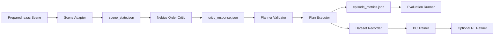

rOCDbot standards-aligned agile agentic execution plan

1. Title and Metadata
- Project name: rOCDbot
- Version: 1.0
- Owners: Research Engineering PM; Robotics/Simulation Engineer; Applied AI/Agent Engineer; ML/Training Engineer; Demo Ops Owner
- Date: 2026-03-15
- Document ID: PLAN-ROCDBOT-20260315-01
- Evidence base: `prd.md`, `prd-old.md`, `.env.example`, `scripts/test_nebius_access.py`, and the current repository baseline
- Repository baseline at planning time:
  - `prd.md`
  - `prd-old.md`
  - `scripts/test_nebius_access.py`
  - `.env.example`
  - no `tests/`, no `plans/`, no app package, no CI workflow, no build manifest
- Summary: This document converts the current rOCDbot repository into a standards-aligned execution plan for a simulation-first order-restoration demo in which a Unitree G1 operating in Isaac Lab detects tabletop misalignment, reasons over a structured scene state with Nebius Token Factory, plans a correction, executes the correction, records before/after metrics, and optionally improves the correction policy with behavior cloning first and reinforcement learning second. The scope includes repository bootstrap, contracts, tests, orchestration, training, evaluation, and governance required to produce a deterministic hackathon-ready demonstration.

2. Design Consensus & Trade-offs

| Topic | Verdict | Rationale |
| --- | --- | --- |
| Simulation-first MVP | FOR | The repository contains no hardware bridge and the PRD centers Isaac Sim/Isaac Lab, making simulation the only credible delivery path for a reliable demo. |
| Real G1 execution on the critical path | AGAINST | No real-robot code or safety controls exist in the repository; adding them would create schedule and safety risk with low demo leverage. |
| Structured scene state to LLM instead of raw frames | FOR | The PRD already defines structured state and the repository only exposes Nebius API smoke access, so schema-first reasoning is faster, cheaper, and more testable than frame-level prompting. |
| Nebius Token Factory as the reasoning provider | FOR | `.env.example` and `scripts/test_nebius_access.py` already encode Nebius model and cloud contracts. |
| LLM as low-level motion controller | AGAINST | The PRD positions the LLM as a semantic critic/planner, which is consistent with testability and safer for embodied execution. |
| Simulator truth for MVP perception | FOR | No perception pipeline exists in the repository; simulator truth removes a major source of instability from the MVP path. |
| Single-object misalignment as the first demo | FOR | It yields a visually obvious before/after change and keeps the action space narrow enough for a dependable hackathon run. |
| Multi-object etiquette rules in the MVP gate | AGAINST | The richer semantic rules are valuable stretch goals but would dilute effort before the single-object end-to-end loop is green. |
| Behavior cloning before RL refinement | FOR | The PRD repeatedly frames RL as optimization, not the day-one blocker; BC provides the shortest path to a working correction policy. |
| Deterministic schema validation between critic and planner | FOR | The absence of application code means interface drift must be prevented from the first implementation phase. |
| Repository bootstrap before feature work | FOR | The current repository has no test harness, app package, or evaluation runner; implementation before bootstrap would violate TDD and traceability. |

3. PRD (IEEE 29148 Stakeholder/System Needs)
- Problem:
  - Robots can execute explicit tasks but usually do not detect and correct subtle disorder such as a tabletop object rotated off axis or placed outside a target zone.
- Users:
  - Hackathon judges viewing the live demo
  - Research engineers building the embodied AI stack
  - ML engineers training correction policies
  - Operators preparing prepared-scene evaluations
- Value:
  - Demonstrates a reusable order-restoration layer that converts semantic judgment into embodied corrective action.
- Business goals:
  - Deliver one deterministic single-command demo for a prepared tabletop alignment scenario.
  - Show measurable improvement before vs after execution.
  - Establish a repo and test harness that can support BC now and RL later.
- Success metrics:
  - Prepared-scene correction success rate `>= 0.70`
  - Planner valid JSON/action plan rate `>= 0.95`
  - Post-correction yaw error `<= 5 deg`
  - Post-correction position error `<= 3 cm`
  - Critic p95 latency `<= 2.0 s` for prepared scenes, excluding simulator startup
  - Episode duration `<= 45 s`
  - Reset duration `<= 30 s`
- Scope:
  - Isaac Lab single-object alignment environment
  - Structured scene export
  - Nebius-backed order critic
  - Planner and fail-closed safety gate
  - End-to-end demo orchestration and telemetry
  - Dataset recording and BC baseline
  - Optional RL refinement behind an explicit gate
- Non-goals:
  - Real-world unsupervised robot operation
  - Full camera perception stack in the MVP gate
  - Training humanoid locomotion from scratch
  - Multi-room autonomy
  - Broad semantic etiquette coverage before the core alignment demo is stable
- Dependencies:
  - Python 3 runtime
  - Nebius Token Factory credentials and reachable endpoint
  - Nebius Cloud CLI only for optional cloud checks
  - Isaac Sim/Isaac Lab GPU environment for simulator-dependent phases
  - Git for restore points and phase tags
- Risks:
  - Simulator/runtime pinning is absent from the current repo.
  - Nebius connectivity may fail or return schema-invalid output.
  - Training can expand beyond hackathon scope if RL starts too early.
  - Without metrics and logging, the demo can degrade into a generic pick-and-place narrative.
- Assumptions:
  - MVP evaluation uses prepared scenes with a single target object.
  - Simulator truth is available before any vision estimator work.
  - The team accepts a simulation-first deliverable as the release gate.

4. SRS (IEEE 29148 Canonical Requirements)
4.1 Functional Requirements
- REQ-001 [type: func]: The system shall export a versioned `scene_state` object from the simulator or simulator-truth adapter for each episode, including object pose, target pose, table axis, and robot pose.
- REQ-002 [type: func]: The system shall compute disorder metrics for the target object, including yaw error, position error, and whether the scene violates the configured order rule.
- REQ-003 [type: func]: The system shall call Nebius Token Factory with a structured scene payload and receive a schema-valid `critic_response` containing `is_disordered`, `severity`, `violations`, and `plan`.
- REQ-004 [type: func]: The planner shall validate the critic response against an allowed skill vocabulary and reject unsupported or unsafe actions before execution.
- REQ-005 [type: func]: The system shall provide a single-command episode runner that performs reset, scene export, critique, planning, execution, evaluation, and artifact persistence.
- REQ-006 [type: func]: The system shall emit before/after metrics per episode, including yaw error, position error, success flag, latency, and trace identifier.
- REQ-007 [type: func]: The system shall persist training/evaluation episode records suitable for downstream policy training.
- REQ-008 [type: func]: The training workflow shall train a BC baseline from recorded or generated datasets and shall allow RL refinement only behind an explicit opt-in gate after BC metrics are green.
4.2 Non-functional Requirements
- REQ-009 [type: perf]: Prepared-scene order-critic p95 latency shall be `<= 2.0 s`, excluding simulator startup.
- REQ-010 [type: nfr]: Prepared-scene end-to-end success rate shall be `>= 0.70`, episode runtime shall be `<= 45 s`, and reset runtime shall be `<= 30 s`.
- REQ-011 [type: nfr]: The system shall be reproducible by seed, artifact version, and trace log so that any evaluated episode can be replayed from recorded inputs.
- REQ-012 [type: nfr]: The system shall fail closed on missing secrets, invalid schema, or unsupported plans and shall emit structured error codes without attempting unsafe action execution.
4.3 Interfaces/APIs
- REQ-013 [type: int]: The repository shall define a stable `.env` contract for Nebius Token Factory and optional Nebius Cloud settings; secrets shall only be read from environment variables or local `.env` files excluded from version control.
- REQ-014 [type: int]: Internal interfaces shall serialize versioned `scene_state.json`, `critic_response.json`, `plan.json`, and `episode_metrics.json` artifacts.
4.4 Data Requirements
- REQ-015 [type: data]: Training and evaluation datasets shall store `episode_id`, `seed`, `scene_state`, `critic_response`, `planned_actions`, `execution_result`, `metrics`, and timestamps.
- REQ-016 [type: data]: Logs and datasets shall exclude secret values and direct token material; secret-bearing keys shall be redacted before persistence.
4.5 Error & Telemetry expectations
- Every episode log shall include `trace_id`, `phase`, `seed`, `scene_schema_version`, `critic_model`, and `result_code`.
- Error codes shall distinguish `missing_config`, `critic_schema_error`, `planner_rejection`, `execution_failure`, and `eval_threshold_failure`.
- Telemetry shall be emitted as structured JSONL files under `artifacts/runs/<trace_id>/`.
- No unsafe planner output may pass into execution after a `planner_rejection`.
4.6 Acceptance Criteria
- A prepared single-object scene visibly starts misaligned and ends aligned.
- The system emits one human-readable explanation of what is wrong with the scene.
- The episode runner persists all required artifacts for the run.
- Holdout evaluation meets all phase-threshold metrics without manual patching between episodes.
- BC training smoke produces a checkpoint artifact and metrics file from a minimal dataset.
- RL refinement, if enabled, improves final placement precision without reducing success rate beyond the allowed regression budget.
4.7 System Architecture Diagram

```text
[Person: Judge/Operator]
    |
    v
[Container: Episode Runner CLI]
    |
    +--> [Component: Scene Adapter] --> [Artifact: scene_state.json]
    +--> [Component: Order Critic Client] --> [Artifact: critic_response.json]
    +--> [Component: Planner Validator] --> [Artifact: plan.json]
    +--> [Component: Executor] --> [Artifact: episode_metrics.json]
    +--> [Component: Dataset Recorder] --> [Container: datasets/]
    +--> [Container: Evaluation Scripts]
    +--> [Container: Training Scripts]
```

5. Iterative Implementation & Test Plan (ISO/IEC/IEEE 12207 + 29119-3)
- Phase Strategy:
  - P00 bootstraps the repository, contracts, and test harness because the current repo has no application or test structure.
  - P01-P03 build the single-object MVP path in increasing dependency order: scene contract, reasoning/planning, then orchestration.
  - P04-P06 add training, holdout evaluation, and optional RL only after the MVP path is measurable.
- Compute Policy:
  - `branch_limits`: only `main` plus one active feature branch per phase; one additional short-lived spike branch is allowed for simulator-runtime discovery and must be closed before phase exit.
  - `reflection_passes`: 2 passes per phase by default; 3 passes for contract or safety-gate changes; 1 pass for documentation-only changes.
  - `early_stop%`: stop a phase when the primary metric regresses by more than 5% from the previous green baseline or when 80% of the runtime budget is consumed with less than 1% gain across 3 consecutive runs.
- Governance:
  - Any metric threshold change requires a new ADR and an RTM update before implementation continues.
- State Safety:
  - Create git tags `restore/Pxx-start` before work starts and `restore/Pxx-end` only after the phase reaches green exit.
- Risk Register:

| Risk | Trigger | Mitigation |
| --- | --- | --- |
| Simulator runtime drift | Isaac-dependent code starts before version pinning | Block simulator phases until ADR-002 pins runtime and driver floor. |
| Nebius schema instability | Critic returns malformed or non-deterministic JSON | Validate strict schema, keep prepared fixtures, and fail closed. |
| Planner unsafe action expansion | New verbs appear in critic output | Allowed vocabulary list and hard rejection path. |
| BC/RL scope explosion | Training starts before MVP eval gates are green | Freeze RL behind REQ-008 gate and ADR approval. |
| Demo becomes generic pick-and-place | Explanation and before/after metrics are missing | Make explanation and metric artifacts acceptance criteria. |
| Dataset contamination | Metrics or secrets leak into training records | Redaction tests plus schema validation on persisted episodes. |
- Suspension/Resumption Criteria:
  - Suspend execution on any failing fail-closed test, missing restore tag, unpinned simulator runtime, missing Nebius credentials for live critic tests, or holdout metrics below required thresholds.
  - Resume only after the blocking issue is fixed on the active phase branch, the same RED/GREEN command pair has been rerun, and a new restore tag is created if rollback occurred.

### Phase P00: Repository Bootstrap and Contract Harness
- Scope and objectives:
  - Impacted REQ-012, REQ-013, REQ-016.
  - Establish package layout, `tests/`, `artifacts/`, `datasets/`, `docs/adr/`, and a repeatable unit-test harness.
- Iterative execution steps:
  - Step 1 (RED): Create/update TEST-001 in `tests/unit/test_env_contract.py` for REQ-012, REQ-013, REQ-016 -> run `TEST_ID=TEST-001 python3 -m unittest tests.unit.test_env_contract.TestEnvContract.test_missing_required_env_vars_fail_closed` -> expected: FAIL because `rocdbot/config.py`, the `tests` package, and fail-closed config handling do not exist.
  - Step 2 (GREEN): Implement minimal bootstrap in `rocdbot/config.py`, `rocdbot/logging.py`, `tests/__init__.py`, `tests/unit/test_env_contract.py`, `scripts/evals/run_repo_contract_eval.py`, and `docs/adr/ADR-001-metric-governance.md` -> run `TEST_ID=TEST-001 python3 -m unittest tests.unit.test_env_contract.TestEnvContract.test_missing_required_env_vars_fail_closed` -> expected: PASS.
  - Step 3 (REFACTOR): Centralize env parsing, redaction helpers, and trace-id generation; add `# TEST-001` tags -> run `TEST_ID=TEST-001 python3 -m unittest discover -s tests/unit -p 'test_*.py'` -> expected: PASS.
  - Step 4 (MEASURE): Run bootstrap contract eval -> run `EVAL_ID=EVAL-000 python3 scripts/evals/run_repo_contract_eval.py --eval-id EVAL-000` -> expected: `unit_pass_rate=1.0`, required directories exist, runtime `<= 10 s`.
- Exit Gate Rules:
  - Green: all P00 commands pass; ADR-001 exists; tags `restore/P00-start` and `restore/P00-end` exist.
  - Yellow: unit tests pass but repo-contract runtime exceeds `10 s` or ADR-001 is incomplete.
  - Red: any fail-closed or redaction assertion fails.
- Phase Metrics:
  - Confidence `90%`; rationale: the work is local Python/bootstrap work with no simulator dependency.
  - Long-term robustness `85%`; rationale: central config and logging reduce future drift.
  - Internal interactions `4`; rationale: config, logging, tests, and eval scaffolding must align.
  - External interactions `1`; rationale: only environment-variable contracts are touched.
  - Complexity `20%`; rationale: mostly repository structure and validation.
  - Feature creep `10%`; rationale: tightly bounded to scaffolding.
  - Technical debt `15%`; rationale: low if contracts are centralized immediately.
  - YAGNI score `90%`; rationale: every added file is required to enable TDD.
  - MoSCoW `Must`; rationale: all later phases depend on this scaffold.
  - Local/Non-local scope `Mostly local`; rationale: changes stay within root package, tests, and docs.
  - Architectural changes count `3`; rationale: package skeleton, test harness, eval harness.

### Phase P01: Scene State and Disorder Metrics
- Scope and objectives:
  - Impacted REQ-001, REQ-002, REQ-006, REQ-014, REQ-015.
  - Implement the normalized scene schema and deterministic disorder metrics for the MVP alignment task.
- Iterative execution steps:
  - Step 1 (RED): Create/update TEST-002 and TEST-003 in `tests/unit/test_scene_schema.py` and `tests/unit/test_disorder_metrics.py` for REQ-001, REQ-002, REQ-006, REQ-014, REQ-015 -> run `TEST_IDS=TEST-002,TEST-003 python3 -m unittest tests.unit.test_scene_schema.TestSceneSchema.test_scene_state_schema_contains_required_fields tests.unit.test_disorder_metrics.TestDisorderMetrics.test_rotation_and_position_error_calculation` -> expected: FAIL because the scene normalizer and metric functions do not exist.
  - Step 2 (GREEN): Implement `rocdbot/scene/schema.py`, `rocdbot/scene/normalizer.py`, `rocdbot/metrics/disorder.py`, and fixtures under `tests/fixtures/scenes/` -> run `TEST_IDS=TEST-002,TEST-003 python3 -m unittest tests.unit.test_scene_schema.TestSceneSchema.test_scene_state_schema_contains_required_fields tests.unit.test_disorder_metrics.TestDisorderMetrics.test_rotation_and_position_error_calculation` -> expected: PASS.
  - Step 3 (REFACTOR): Remove duplicated field definitions by introducing a shared schema-version constant and add `# TEST-002` and `# TEST-003` tags -> run `TEST_IDS=TEST-002,TEST-003 python3 -m unittest discover -s tests/unit -p 'test_*.py'` -> expected: PASS.
  - Step 4 (MEASURE): Run scene-contract eval -> run `EVAL_ID=EVAL-001 python3 scripts/evals/run_scene_contract_eval.py --eval-id EVAL-001 --fixture tests/fixtures/scenes/single_cube_misaligned.json --seed 17` -> expected: schema coverage `= 1.0`, metric determinism `= 1.0`, runtime `<= 5 s`.
- Exit Gate Rules:
  - Green: schema and metric tests pass; eval determinism is perfect across 3 repeated runs; tags `restore/P01-start` and `restore/P01-end` exist.
  - Yellow: unit tests pass but schema coverage is incomplete for non-MVP fields.
  - Red: any metric calculation is non-deterministic or schema-invalid.
- Phase Metrics:
  - Confidence `85%`; rationale: the contract is clear but new schemas must be introduced.
  - Long-term robustness `88%`; rationale: versioned schemas protect later interfaces.
  - Internal interactions `5`; rationale: scene adapter, metrics, tests, fixtures, and evals interact.
  - External interactions `1`; rationale: simulator truth is represented by fixtures first.
  - Complexity `35%`; rationale: numeric correctness and schema design both matter.
  - Feature creep `15%`; rationale: stretch perception work is explicitly excluded.
  - Technical debt `20%`; rationale: moderate if schema ownership is unclear.
  - YAGNI score `85%`; rationale: only MVP fields are added.
  - MoSCoW `Must`; rationale: the critic and planner require this contract.
  - Local/Non-local scope `Local with artifact implications`; rationale: code is local but formats become cross-cutting.
  - Architectural changes count `4`; rationale: new scene, metrics, fixtures, and eval modules.

### Phase P02: Order Critic Client and Planner Safety Gate
- Scope and objectives:
  - Impacted REQ-003, REQ-004, REQ-012, REQ-013, REQ-014.
  - Implement schema-valid Nebius reasoning and a fail-closed planner validator.
- Iterative execution steps:
  - Step 1 (RED): Create/update TEST-004 and TEST-005 in `tests/unit/test_order_critic_contract.py` and `tests/unit/test_planner_gate.py` for REQ-003, REQ-004, REQ-012, REQ-014 -> run `TEST_IDS=TEST-004,TEST-005 python3 -m unittest tests.unit.test_order_critic_contract.TestOrderCriticContract.test_validates_nebius_response_schema tests.unit.test_planner_gate.TestPlannerGate.test_unsupported_actions_are_rejected` -> expected: FAIL because the critic client, response parser, and planner gate do not exist.
  - Step 2 (GREEN): Implement `rocdbot/critic/client.py`, `rocdbot/critic/schema.py`, and `rocdbot/planner/validator.py` -> run `TEST_IDS=TEST-004,TEST-005 python3 -m unittest tests.unit.test_order_critic_contract.TestOrderCriticContract.test_validates_nebius_response_schema tests.unit.test_planner_gate.TestPlannerGate.test_unsupported_actions_are_rejected` -> expected: PASS.
  - Step 3 (RED): Create/update TEST-006 in `scripts/test_nebius_access.py` for REQ-013 -> run `TEST_ID=TEST-006 python3 scripts/test_nebius_access.py --skip-vision --skip-cloud` -> expected: FAIL because `--skip-cloud` is unsupported and the script still requires cloud CLI access.
  - Step 4 (GREEN): Add `--skip-cloud` support to `scripts/test_nebius_access.py`, keep model reachability checks, and wire fixed prepared-scene fixtures -> run `TEST_ID=TEST-006 python3 scripts/test_nebius_access.py --skip-vision --skip-cloud` -> expected: PASS.
  - Step 5 (REFACTOR): Extract allowed planner vocabulary and critic schema version into shared constants; add `# TEST-004`, `# TEST-005`, and `# TEST-006` tags -> run `TEST_IDS=TEST-004,TEST-005 python3 -m unittest discover -s tests/unit -p 'test_*.py'` -> expected: PASS.
  - Step 6 (MEASURE): Run critic eval on prepared fixtures -> run `EVAL_ID=EVAL-002 python3 scripts/evals/run_order_critic_eval.py --eval-id EVAL-002 --fixtures-dir tests/fixtures/scenes --seed 17 --mode live` -> expected: valid JSON rate `>= 0.95`, unsupported action rate `= 0.0`, p95 latency `<= 2.0 s`.
- Exit Gate Rules:
  - Green: schema and planner tests pass; live or recorded-fixture critic eval meets thresholds; tags `restore/P02-start` and `restore/P02-end` exist.
  - Yellow: unit tests pass but live Nebius connectivity is unavailable; recorded-fixture mode may proceed with an ADR documenting the temporary limitation.
  - Red: unsupported actions pass validation or critic outputs cannot be parsed deterministically.
- Phase Metrics:
  - Confidence `75%`; rationale: external API variability increases implementation risk.
  - Long-term robustness `82%`; rationale: fail-closed planning greatly improves safety.
  - Internal interactions `6`; rationale: scene contract, critic, planner, logs, and tests all couple here.
  - External interactions `3`; rationale: Nebius endpoint, local env, and optional CLI checks are involved.
  - Complexity `50%`; rationale: this is the first major contract boundary.
  - Feature creep `20%`; rationale: raw-vision prompting is explicitly out of scope.
  - Technical debt `25%`; rationale: schema shortcuts here will be expensive later.
  - YAGNI score `78%`; rationale: only required critic fields and allowed verbs are implemented.
  - MoSCoW `Must`; rationale: the system has no order judgment without this phase.
  - Local/Non-local scope `Non-local`; rationale: critic outputs affect planner, telemetry, and later datasets.
  - Architectural changes count `5`; rationale: client, schema, planner gate, smoke-script change, eval harness.

### Phase P03: Episode Orchestration and Telemetry
- Scope and objectives:
  - Impacted REQ-005, REQ-006, REQ-011, REQ-014, REQ-015.
  - Build the single-command episode runner and persist complete per-run artifacts.
- Iterative execution steps:
  - Step 1 (RED): Create/update TEST-007 and TEST-012 in `tests/integration/test_demo_pipeline.py` and `tests/integration/test_replay.py` for REQ-005, REQ-006, REQ-011, REQ-014, REQ-015 -> run `TEST_IDS=TEST-007,TEST-012 python3 -m unittest tests.integration.test_demo_pipeline.TestDemoPipeline.test_single_episode_writes_artifacts tests.integration.test_replay.TestReplay.test_same_seed_reproduces_scene_hash` -> expected: FAIL because the orchestrator, artifact writers, and replay metadata do not exist.
  - Step 2 (GREEN): Implement `rocdbot/orchestrator/run_episode.py`, `rocdbot/artifacts/writer.py`, `rocdbot/replay/hash.py`, and artifact directories under `artifacts/runs/` -> run `TEST_IDS=TEST-007,TEST-012 python3 -m unittest tests.integration.test_demo_pipeline.TestDemoPipeline.test_single_episode_writes_artifacts tests.integration.test_replay.TestReplay.test_same_seed_reproduces_scene_hash` -> expected: PASS.
  - Step 3 (REFACTOR): Normalize artifact naming and trace propagation across writer modules; add `# TEST-007` and `# TEST-012` tags -> run `TEST_IDS=TEST-007,TEST-012 python3 -m unittest discover -s tests/integration -p 'test_*.py'` -> expected: PASS.
  - Step 4 (MEASURE): Run episode artifact completeness eval -> run `EVAL_ID=EVAL-003 python3 scripts/evals/run_episode_eval.py --eval-id EVAL-003 --fixture tests/fixtures/scenes/single_cube_misaligned.json --seed 17` -> expected: artifact completeness `= 1.0`, replay hash stability `= 1.0`, dry-run runtime `<= 10 s`.
- Exit Gate Rules:
  - Green: single-command integration tests pass; artifact completeness is perfect; tags `restore/P03-start` and `restore/P03-end` exist.
  - Yellow: artifacts are present but replay hash changes across runs.
  - Red: required artifacts are missing or trace IDs cannot link the run.
- Phase Metrics:
  - Confidence `80%`; rationale: the interfaces are known after P01-P02, but orchestration is cross-cutting.
  - Long-term robustness `86%`; rationale: artifact and replay discipline strengthens every later phase.
  - Internal interactions `7`; rationale: almost every module participates in the episode runner.
  - External interactions `2`; rationale: simulator adapter and Nebius client are invoked through stable contracts.
  - Complexity `45%`; rationale: coordination logic is broader than earlier phases.
  - Feature creep `15%`; rationale: orchestration stays limited to the prepared-scene path.
  - Technical debt `22%`; rationale: moderate if artifact paths are inconsistent.
  - YAGNI score `80%`; rationale: only run-critical artifacts are persisted.
  - MoSCoW `Must`; rationale: the demo requires one-command execution.
  - Local/Non-local scope `Non-local`; rationale: it touches every active subsystem.
  - Architectural changes count `4`; rationale: orchestrator, artifacts, replay hashing, eval runner.

### Phase P04: Dataset Recorder and BC Baseline
- Scope and objectives:
  - Impacted REQ-007, REQ-008, REQ-011, REQ-015, REQ-016.
  - Persist training-ready episode records and prove a BC smoke path from minimal data to checkpoint artifact.
- Iterative execution steps:
  - Step 1 (RED): Create/update TEST-008 and TEST-009 in `tests/integration/test_dataset_recorder.py` and `tests/integration/test_training_bc.py` for REQ-007, REQ-008, REQ-011, REQ-015, REQ-016 -> run `TEST_IDS=TEST-008,TEST-009 python3 -m unittest tests.integration.test_dataset_recorder.TestDatasetRecorder.test_episode_record_schema tests.integration.test_training_bc.TestTrainingBC.test_training_writes_checkpoint_and_metrics` -> expected: FAIL because the dataset writer and BC training entrypoint do not exist.
  - Step 2 (GREEN): Implement `rocdbot/data/episode_record.py`, `scripts/train_bc.py`, `configs/training/bc_minimal.yaml`, and a synthetic dataset fixture under `tests/fixtures/datasets/` -> run `TEST_IDS=TEST-008,TEST-009 python3 -m unittest tests.integration.test_dataset_recorder.TestDatasetRecorder.test_episode_record_schema tests.integration.test_training_bc.TestTrainingBC.test_training_writes_checkpoint_and_metrics` -> expected: PASS.
  - Step 3 (REFACTOR): Split training config loading from the trainer entrypoint, add redaction on persisted records, and add `# TEST-008` and `# TEST-009` tags -> run `TEST_IDS=TEST-008,TEST-009 python3 -m unittest discover -s tests/integration -p 'test_*.py'` -> expected: PASS.
  - Step 4 (MEASURE): Run BC smoke eval -> run `EVAL_ID=EVAL-004 python3 scripts/evals/run_training_eval.py --eval-id EVAL-004 --dataset tests/fixtures/datasets/minimal_alignment_dataset.json --seed 17 --mode bc-smoke` -> expected: checkpoint artifact exists, metrics file exists, smoke runtime `<= 900 s`.
- Exit Gate Rules:
  - Green: dataset and BC smoke tests pass; checkpoint and metrics artifacts are produced; tags `restore/P04-start` and `restore/P04-end` exist.
  - Yellow: the recorder passes but BC smoke exceeds the runtime budget.
  - Red: persisted records are schema-invalid, non-reproducible by seed, or contain redacted fields incorrectly.
- Phase Metrics:
  - Confidence `72%`; rationale: training tooling introduces more unknowns than earlier phases.
  - Long-term robustness `78%`; rationale: dataset schema discipline reduces retraining churn.
  - Internal interactions `6`; rationale: episode records, configs, trainer, and evals must align.
  - External interactions `2`; rationale: trainer dependencies and simulator-generated data are external.
  - Complexity `55%`; rationale: artifact correctness and runtime both matter.
  - Feature creep `18%`; rationale: RL is still blocked.
  - Technical debt `28%`; rationale: high if training configs are not versioned.
  - YAGNI score `76%`; rationale: smoke training only, not full research loops.
  - MoSCoW `Should`; rationale: BC is the primary learning story after the MVP loop.
  - Local/Non-local scope `Mixed`; rationale: code is local but artifacts span datasets and configs.
  - Architectural changes count `4`; rationale: data recorder, trainer entrypoint, configs, eval runner.

### Phase P05: Prepared-Scene Holdout Evaluation and Safety Regression
- Scope and objectives:
  - Impacted REQ-009, REQ-010, REQ-011, REQ-012.
  - Prove that the full prepared-scene path satisfies latency, success, reset, and fail-closed regression gates.
- Iterative execution steps:
  - Step 1 (RED): Create/update TEST-010 and TEST-011 in `tests/perf/test_order_critic_latency.py` and `tests/perf/test_prepared_scene_holdout.py` for REQ-009, REQ-010, REQ-011, REQ-012 -> run `TEST_IDS=TEST-010,TEST-011 python3 -m unittest tests.perf.test_order_critic_latency.TestOrderCriticLatency.test_p95_latency_under_threshold tests.perf.test_prepared_scene_holdout.TestPreparedSceneHoldout.test_holdout_thresholds` -> expected: FAIL because the perf harness, reset timers, and threshold assertions do not yet exist or do not meet thresholds.
  - Step 2 (GREEN): Implement holdout fixtures, perf assertions, and reset timers -> run `TEST_IDS=TEST-010,TEST-011 python3 -m unittest tests.perf.test_order_critic_latency.TestOrderCriticLatency.test_p95_latency_under_threshold tests.perf.test_prepared_scene_holdout.TestPreparedSceneHoldout.test_holdout_thresholds` -> expected: PASS.
  - Step 3 (REFACTOR): Remove duplicated thresholds by centralizing them in a versioned metrics config and add `# TEST-010` and `# TEST-011` tags -> run `TEST_IDS=TEST-010,TEST-011 python3 -m unittest discover -s tests -p 'test_*.py'` -> expected: PASS.
  - Step 4 (MEASURE): Run the holdout evaluation -> run `EVAL_ID=EVAL-005 python3 scripts/evals/run_prepared_scene_eval.py --eval-id EVAL-005 --episodes 20 --seed 29` -> expected: success rate `>= 0.70`, critic p95 latency `<= 2.0 s`, episode runtime `<= 45 s`, reset runtime `<= 30 s`, post-yaw error `<= 5 deg`, post-position error `<= 3 cm`, unsafe executions `= 0`.
- Exit Gate Rules:
  - Green: all thresholds pass on the holdout run; tags `restore/P05-start` and `restore/P05-end` exist.
  - Yellow: all safety assertions pass but one performance metric misses threshold by `<= 5%`; an ADR may be used only to defer a stretch metric, not an MVP gate.
  - Red: any unsafe execution occurs, holdout success falls below `0.70`, or replayability fails.
- Phase Metrics:
  - Confidence `68%`; rationale: this is the first complete system-quality gate.
  - Long-term robustness `84%`; rationale: a strong holdout gate prevents demo drift.
  - Internal interactions `8`; rationale: all MVP subsystems are exercised together.
  - External interactions `3`; rationale: simulator runtime, Nebius, and training artifacts all participate.
  - Complexity `65%`; rationale: threshold compliance across subsystems is difficult.
  - Feature creep `12%`; rationale: stretch features remain blocked by holdout discipline.
  - Technical debt `24%`; rationale: manageable if thresholds stay centralized.
  - YAGNI score `82%`; rationale: only gate metrics required by the demo are measured.
  - MoSCoW `Must`; rationale: this is the release gate for the MVP.
  - Local/Non-local scope `Strongly non-local`; rationale: the full stack is under test.
  - Architectural changes count `3`; rationale: perf harness, metrics config, holdout runner.

### Phase P06: Optional RL Refinement
- Scope and objectives:
  - Impacted REQ-008, REQ-010, REQ-011.
  - Add RL refinement only if P05 is green and the BC baseline is stable.
- Iterative execution steps:
  - Step 1 (RED): Create/update TEST-013 in `tests/integration/test_training_rl_gate.py` for REQ-008, REQ-010, REQ-011 -> run `TEST_ID=TEST-013 python3 -m unittest tests.integration.test_training_rl_gate.TestTrainingRLGate.test_rl_requires_green_bc_baseline` -> expected: FAIL because RL refinement is absent or not gated on BC metrics.
  - Step 2 (GREEN): Implement `scripts/train_rl_refine.py`, `configs/training/rl_refine.yaml`, and BC-baseline gate checks -> run `TEST_ID=TEST-013 python3 -m unittest tests.integration.test_training_rl_gate.TestTrainingRLGate.test_rl_requires_green_bc_baseline` -> expected: PASS.
  - Step 3 (REFACTOR): Isolate RL-specific reward and optimizer configs from the BC path and add `# TEST-013` tags -> run `TEST_ID=TEST-013 python3 -m unittest discover -s tests/integration -p 'test_*.py'` -> expected: PASS.
  - Step 4 (MEASURE): Run the RL refinement eval -> run `EVAL_ID=EVAL-006 python3 scripts/evals/run_rl_refinement_eval.py --eval-id EVAL-006 --episodes 10 --seed 43 --enable-rl` -> expected: post-placement precision improves by `>= 5%` over BC while success rate degrades by `< 0.02`.
- Exit Gate Rules:
  - Green: RL refinement meets the improvement target without violating P05 safety or success gates; tags `restore/P06-start` and `restore/P06-end` exist.
  - Yellow: RL is reproducible but fails to improve metrics; defer by ADR without blocking release.
  - Red: RL introduces unsafe or non-reproducible regressions.
- Phase Metrics:
  - Confidence `55%`; rationale: RL remains the most schedule-sensitive and compute-heavy item.
  - Long-term robustness `70%`; rationale: useful only if it stays isolated from the BC path.
  - Internal interactions `6`; rationale: training, metrics, configs, and evaluation interact.
  - External interactions `3`; rationale: simulator runtime, compute budget, and training deps are involved.
  - Complexity `72%`; rationale: optimization stability is inherently harder than contract work.
  - Feature creep `25%`; rationale: stretch-phase research can expand quickly.
  - Technical debt `30%`; rationale: high if RL shares too much code with BC.
  - YAGNI score `60%`; rationale: RL is explicitly optional.
  - MoSCoW `Could`; rationale: this phase is stretch value, not the MVP gate.
  - Local/Non-local scope `Non-local`; rationale: training code changes affect evaluation baselines.
  - Architectural changes count `3`; rationale: RL runner, config, and eval harness.

6. Evaluations (AI/Agentic Specific)
```yaml
evals:
  - id: EVAL-000
    purpose: dev
    metrics:
      unit_pass_rate: 1.0
      repo_contract_runtime_s: 10
    thresholds:
      unit_pass_rate: "==1.0"
      repo_contract_runtime_s: "<=10"
    seeds: [17]
    runtime_budget: "10s"
  - id: EVAL-001
    purpose: dev
    metrics:
      schema_coverage: 1.0
      metric_determinism: 1.0
      runtime_s: 5
    thresholds:
      schema_coverage: "==1.0"
      metric_determinism: "==1.0"
      runtime_s: "<=5"
    seeds: [17]
    runtime_budget: "5s"
  - id: EVAL-002
    purpose: dev
    metrics:
      valid_json_rate: 0.95
      unsupported_action_rate: 0.0
      p95_latency_s: 2.0
    thresholds:
      valid_json_rate: ">=0.95"
      unsupported_action_rate: "==0.0"
      p95_latency_s: "<=2.0"
    seeds: [17, 19, 23]
    runtime_budget: "2m"
  - id: EVAL-003
    purpose: dev
    metrics:
      artifact_completeness: 1.0
      replay_hash_stability: 1.0
      runtime_s: 10
    thresholds:
      artifact_completeness: "==1.0"
      replay_hash_stability: "==1.0"
      runtime_s: "<=10"
    seeds: [17]
    runtime_budget: "10s"
  - id: EVAL-004
    purpose: dev
    metrics:
      checkpoint_written: 1.0
      metrics_written: 1.0
      runtime_s: 900
    thresholds:
      checkpoint_written: "==1.0"
      metrics_written: "==1.0"
      runtime_s: "<=900"
    seeds: [17]
    runtime_budget: "15m"
  - id: EVAL-005
    purpose: holdout
    metrics:
      success_rate: 0.70
      p95_latency_s: 2.0
      episode_runtime_s: 45
      reset_runtime_s: 30
      post_yaw_error_deg: 5
      post_position_error_cm: 3
      unsafe_executions: 0
    thresholds:
      success_rate: ">=0.70"
      p95_latency_s: "<=2.0"
      episode_runtime_s: "<=45"
      reset_runtime_s: "<=30"
      post_yaw_error_deg: "<=5"
      post_position_error_cm: "<=3"
      unsafe_executions: "==0"
    seeds: [29, 31, 37]
    runtime_budget: "30m"
  - id: EVAL-006
    purpose: adv
    metrics:
      precision_gain_vs_bc: 0.05
      success_regression_vs_bc: 0.02
    thresholds:
      precision_gain_vs_bc: ">=0.05"
      success_regression_vs_bc: "<0.02"
    seeds: [43, 47]
    runtime_budget: "45m"
```

7. Tests (ISO/IEC/IEEE 29119-3)
7.1 Test Inventory (Repo-Grounded)
- Current repo-discovered executable validation:
  - `scripts/test_nebius_access.py`
  - current command: `python3 scripts/test_nebius_access.py --skip-vision`
  - purpose: live Nebius reachability smoke test
- Current repo test-framework reality:
  - no `tests/` directory
  - no `package.json`
  - no `pyproject.toml`
  - no CI workflow
  - no existing suite runner besides direct Python script execution
- Planned additions introduced by P00 and required by this plan:
  - unit tests under `tests/unit/` using `python3 -m unittest`
  - integration tests under `tests/integration/` using `python3 -m unittest`
  - perf tests under `tests/perf/` using `python3 -m unittest`
  - eval runners under `scripts/evals/`
7.2 Test Suites Overview

| Suite | Purpose | Runner | Command | Runtime budget | When it runs |
| --- | --- | --- | --- | --- | --- |
| Unit | Config, schema, metrics, planner contracts | Python `unittest` | `python3 -m unittest discover -s tests/unit -p 'test_*.py'` | `<= 30 s` | pre-commit and CI |
| Integration | End-to-end episode artifacts, dataset recording, training smoke | Python `unittest` | `python3 -m unittest discover -s tests/integration -p 'test_*.py'` | `<= 10 m` | CI and before phase exit |
| E2E | Prepared-scene full-stack demo gate | Eval script | `python3 scripts/evals/run_prepared_scene_eval.py --eval-id EVAL-005 --episodes 20 --seed 29` | `<= 30 m` | before release and demo rehearsal |
| Perf | Latency and holdout thresholds | Python `unittest` + eval scripts | `python3 -m unittest discover -s tests/perf -p 'test_*.py'` | `<= 30 m` | nightly and before release |
| Data Drift | Dataset schema and redaction drift | Python `unittest` | `python3 -m unittest discover -s tests/data -p 'test_*.py'` | `<= 5 m` | CI nightly after data changes |
| Static | Repo contract, threshold config, ADR linkage | Python `unittest` | `python3 -m unittest discover -s tests/static -p 'test_*.py'` | `<= 30 s` | pre-commit and CI |
7.3 Test Definitions
- id: TEST-001
  - name: missing_env_fails_closed
  - type: unit
  - verifies: REQ-012, REQ-013, REQ-016
  - location: `tests/unit/test_env_contract.py`
  - command: `TEST_ID=TEST-001 python3 -m unittest tests.unit.test_env_contract.TestEnvContract.test_missing_required_env_vars_fail_closed`
  - fixtures/mocks/data: patched `os.environ`; `tests/fixtures/env/minimal_env.env` to be created
  - deterministic controls: `PYTHONHASHSEED=0`; timeout `5 s`
  - pass_criteria: raises a typed `missing_config` error and writes no secret value to logs or artifacts
  - expected_runtime: `2 s`
- id: TEST-002
  - name: scene_state_schema_required_fields
  - type: unit
  - verifies: REQ-001, REQ-014, REQ-015
  - location: `tests/unit/test_scene_schema.py`
  - command: `TEST_ID=TEST-002 python3 -m unittest tests.unit.test_scene_schema.TestSceneSchema.test_scene_state_schema_contains_required_fields`
  - fixtures/mocks/data: `tests/fixtures/scenes/single_cube_misaligned.json` to be created
  - deterministic controls: fixed fixture payload; timeout `5 s`
  - pass_criteria: schema contains all required fields and a version string; serialization is stable across repeated loads
  - expected_runtime: `2 s`
- id: TEST-003
  - name: disorder_metrics_rotation_position
  - type: unit
  - verifies: REQ-002, REQ-006
  - location: `tests/unit/test_disorder_metrics.py`
  - command: `TEST_ID=TEST-003 python3 -m unittest tests.unit.test_disorder_metrics.TestDisorderMetrics.test_rotation_and_position_error_calculation`
  - fixtures/mocks/data: `tests/fixtures/scenes/single_cube_misaligned.json`; `tests/fixtures/scenes/single_cube_aligned.json` to be created
  - deterministic controls: fixed floating-point tolerances; timeout `5 s`
  - pass_criteria: computed yaw and position errors match fixture expectations within tolerance and success flag flips only on aligned fixture
  - expected_runtime: `2 s`
- id: TEST-004
  - name: critic_response_schema_validation
  - type: unit
  - verifies: REQ-003, REQ-012, REQ-014
  - location: `tests/unit/test_order_critic_contract.py`
  - command: `TEST_ID=TEST-004 python3 -m unittest tests.unit.test_order_critic_contract.TestOrderCriticContract.test_validates_nebius_response_schema`
  - fixtures/mocks/data: canned critic responses under `tests/fixtures/critic/` to be created
  - deterministic controls: mocked HTTP responses; timeout `5 s`
  - pass_criteria: valid responses parse successfully; malformed or missing fields raise `critic_schema_error`
  - expected_runtime: `3 s`
- id: TEST-005
  - name: planner_rejects_unsupported_actions
  - type: unit
  - verifies: REQ-004, REQ-012
  - location: `tests/unit/test_planner_gate.py`
  - command: `TEST_ID=TEST-005 python3 -m unittest tests.unit.test_planner_gate.TestPlannerGate.test_unsupported_actions_are_rejected`
  - fixtures/mocks/data: invalid and valid plan fixtures under `tests/fixtures/plans/` to be created
  - deterministic controls: fixed vocabulary list; timeout `5 s`
  - pass_criteria: any action outside the allowlist causes `planner_rejection`; valid plans pass unchanged
  - expected_runtime: `2 s`
- id: TEST-006
  - name: nebius_smoke_skip_cloud
  - type: integration
  - verifies: REQ-003, REQ-013
  - location: `scripts/test_nebius_access.py`
  - command: `TEST_ID=TEST-006 python3 scripts/test_nebius_access.py --skip-vision --skip-cloud`
  - fixtures/mocks/data: local `.env`; live Nebius endpoint
  - deterministic controls: fixed model IDs from `.env`; HTTP timeout `90 s`; no cloud CLI dependency
  - pass_criteria: exits `0`, validates reachable models, and returns a successful text completion without requiring cloud CLI access
  - expected_runtime: `90 s`
- id: TEST-007
  - name: single_episode_writes_required_artifacts
  - type: integration
  - verifies: REQ-005, REQ-006, REQ-014, REQ-015
  - location: `tests/integration/test_demo_pipeline.py`
  - command: `TEST_ID=TEST-007 python3 -m unittest tests.integration.test_demo_pipeline.TestDemoPipeline.test_single_episode_writes_artifacts`
  - fixtures/mocks/data: prepared scene fixture; mocked executor; temp artifact directory
  - deterministic controls: seed `17`; patched clock or monotonic stub; timeout `10 s`
  - pass_criteria: run writes `scene_state.json`, `critic_response.json`, `plan.json`, and `episode_metrics.json` under one trace directory
  - expected_runtime: `5 s`
- id: TEST-008
  - name: dataset_record_schema_is_training_ready
  - type: integration
  - verifies: REQ-007, REQ-015, REQ-016
  - location: `tests/integration/test_dataset_recorder.py`
  - command: `TEST_ID=TEST-008 python3 -m unittest tests.integration.test_dataset_recorder.TestDatasetRecorder.test_episode_record_schema`
  - fixtures/mocks/data: completed episode artifacts from TEST-007; temp dataset output path
  - deterministic controls: seed `17`; timeout `10 s`
  - pass_criteria: persisted dataset row contains all required fields, timestamps, and redacted secret-bearing keys
  - expected_runtime: `5 s`
- id: TEST-009
  - name: bc_training_smoke_writes_checkpoint
  - type: integration
  - verifies: REQ-008, REQ-011
  - location: `tests/integration/test_training_bc.py`
  - command: `TEST_ID=TEST-009 python3 -m unittest tests.integration.test_training_bc.TestTrainingBC.test_training_writes_checkpoint_and_metrics`
  - fixtures/mocks/data: `tests/fixtures/datasets/minimal_alignment_dataset.json` to be created; `configs/training/bc_minimal.yaml`
  - deterministic controls: seed `17`; single-epoch smoke mode; timeout `900 s`
  - pass_criteria: training exits `0`, writes one checkpoint file and one metrics JSON, and produces identical metric hashes on repeated same-seed runs
  - expected_runtime: `900 s`
- id: TEST-010
  - name: critic_latency_within_threshold
  - type: perf
  - verifies: REQ-009
  - location: `tests/perf/test_order_critic_latency.py`
  - command: `TEST_ID=TEST-010 python3 -m unittest tests.perf.test_order_critic_latency.TestOrderCriticLatency.test_p95_latency_under_threshold`
  - fixtures/mocks/data: prepared scene fixtures in `tests/fixtures/scenes/`
  - deterministic controls: seeds `17,19,23`; fixed prompt template; timeout `120 s`
  - pass_criteria: measured p95 latency on the prepared-scene set is `<= 2.0 s`
  - expected_runtime: `120 s`
- id: TEST-011
  - name: prepared_scene_holdout_thresholds
  - type: perf
  - verifies: REQ-010, REQ-011, REQ-012
  - location: `tests/perf/test_prepared_scene_holdout.py`
  - command: `TEST_ID=TEST-011 python3 -m unittest tests.perf.test_prepared_scene_holdout.TestPreparedSceneHoldout.test_holdout_thresholds`
  - fixtures/mocks/data: holdout scenes under `tests/fixtures/scenes/holdout/` to be created; artifact output dir
  - deterministic controls: seeds `29,31,37`; timeout `1800 s`
  - pass_criteria: success rate `>= 0.70`; episode runtime `<= 45 s`; reset runtime `<= 30 s`; unsafe executions `= 0`
  - expected_runtime: `1800 s`
- id: TEST-012
  - name: replay_hash_is_seed_stable
  - type: integration
  - verifies: REQ-011, REQ-014, REQ-015
  - location: `tests/integration/test_replay.py`
  - command: `TEST_ID=TEST-012 python3 -m unittest tests.integration.test_replay.TestReplay.test_same_seed_reproduces_scene_hash`
  - fixtures/mocks/data: prepared scene fixture; recorded artifact traces
  - deterministic controls: seed `17`; timeout `10 s`
  - pass_criteria: repeated same-seed runs produce the same scene hash and artifact metadata except allowed timestamps
  - expected_runtime: `5 s`
- id: TEST-013
  - name: rl_refinement_requires_green_bc_gate
  - type: integration
  - verifies: REQ-008, REQ-010, REQ-011
  - location: `tests/integration/test_training_rl_gate.py`
  - command: `TEST_ID=TEST-013 python3 -m unittest tests.integration.test_training_rl_gate.TestTrainingRLGate.test_rl_requires_green_bc_baseline`
  - fixtures/mocks/data: BC metrics fixture in `tests/fixtures/training/bc_metrics_green.json` and failing fixture `tests/fixtures/training/bc_metrics_red.json` to be created
  - deterministic controls: seed `43`; timeout `30 s`
  - pass_criteria: RL entrypoint refuses to run on red BC metrics and allows execution only when the BC baseline is green
  - expected_runtime: `10 s`
- Traceability Tag Requirement:
  - Every created or modified test file shall include a grep-able Python comment in the form `# TEST-###`.
7.4 Manual Checks
- CHECK-001: Run the prepared-scene demo once with screen capture enabled and verify the before scene is visibly misaligned and the after scene is visibly aligned.
- CHECK-002: Read the generated one-sentence explanation from the latest artifact and verify it states both the violation and the corrective action in plain language.

8. Data Contract
- Schema snapshot:
```json
{
  "schema_version": "1.0.0",
  "episode_id": "uuid",
  "seed": 17,
  "scene_state": {
    "table_axis_deg": 0.0,
    "target_object_id": "cube_01",
    "objects": [
      {
        "id": "cube_01",
        "class": "cube",
        "pose": {"x": 0.0, "y": 0.0, "z": 0.0, "yaw_deg": 30.0},
        "target_pose": {"x": 0.0, "y": 0.0, "z": 0.0, "yaw_deg": 0.0}
      }
    ],
    "robot": {"base_pose": {"x": 0.0, "y": 0.0, "yaw_deg": 0.0}}
  },
  "critic_response": {
    "is_disordered": true,
    "severity": 0.88,
    "violations": [{"object_id": "cube_01", "type": "rotation_misalignment"}],
    "plan": ["navigate_to_object", "grasp_object", "rotate_to_target_yaw", "place_on_target"]
  },
  "execution_result": {
    "status": "success",
    "result_code": "ok"
  },
  "metrics": {
    "yaw_error_before_deg": 30.0,
    "yaw_error_after_deg": 2.0,
    "position_error_before_cm": 4.2,
    "position_error_after_cm": 1.1,
    "success": true,
    "latency_s": 1.4
  }
}
```
- Invariants:
  - `schema_version` is mandatory and semver-like.
  - MVP uses exactly one `target_object_id`.
  - All yaw fields are degrees in `[-180, 180]`.
  - `plan` verbs must be from the planner allowlist.
  - Metrics must include both before and after values.
  - Secret-bearing env values never appear in any artifact field.

9. Reproducibility
- Seeds:
  - Dev/unit seed: `17`
  - Holdout seed set: `29,31,37`
  - RL seed set: `43,47`
- Local planning baseline:
  - OS: Linux x86_64, kernel `6.6.87.2-microsoft-standard-WSL2`
  - Python: `3.13.2`
  - Git: `/usr/bin/git`
- Hardware tiers:
  - Tier 1: CPU-only local runs for unit, static, and integration tests that use fixtures/mocks
  - Tier 2: NVIDIA GPU Linux environment for simulator, perf, BC, and RL phases
- Driver/container policy:
  - No simulator-dependent phase may start until ADR-002 records the exact Isaac runtime pin, container tag, and NVIDIA driver floor in the repository.

10. RTM (Requirements Traceability Matrix)

| Phase | REQ-### | TEST-### | Test Path | Command |
| --- | --- | --- | --- | --- |
| P00 | REQ-012 | TEST-001 | `tests/unit/test_env_contract.py` | `TEST_ID=TEST-001 python3 -m unittest tests.unit.test_env_contract.TestEnvContract.test_missing_required_env_vars_fail_closed` |
| P00 | REQ-013 | TEST-001 | `tests/unit/test_env_contract.py` | `TEST_ID=TEST-001 python3 -m unittest tests.unit.test_env_contract.TestEnvContract.test_missing_required_env_vars_fail_closed` |
| P00 | REQ-016 | TEST-001 | `tests/unit/test_env_contract.py` | `TEST_ID=TEST-001 python3 -m unittest tests.unit.test_env_contract.TestEnvContract.test_missing_required_env_vars_fail_closed` |
| P01 | REQ-001 | TEST-002 | `tests/unit/test_scene_schema.py` | `TEST_ID=TEST-002 python3 -m unittest tests.unit.test_scene_schema.TestSceneSchema.test_scene_state_schema_contains_required_fields` |
| P01 | REQ-002 | TEST-003 | `tests/unit/test_disorder_metrics.py` | `TEST_ID=TEST-003 python3 -m unittest tests.unit.test_disorder_metrics.TestDisorderMetrics.test_rotation_and_position_error_calculation` |
| P01 | REQ-006 | TEST-003 | `tests/unit/test_disorder_metrics.py` | `TEST_ID=TEST-003 python3 -m unittest tests.unit.test_disorder_metrics.TestDisorderMetrics.test_rotation_and_position_error_calculation` |
| P01 | REQ-014 | TEST-002 | `tests/unit/test_scene_schema.py` | `TEST_ID=TEST-002 python3 -m unittest tests.unit.test_scene_schema.TestSceneSchema.test_scene_state_schema_contains_required_fields` |
| P01 | REQ-015 | TEST-002 | `tests/unit/test_scene_schema.py` | `TEST_ID=TEST-002 python3 -m unittest tests.unit.test_scene_schema.TestSceneSchema.test_scene_state_schema_contains_required_fields` |
| P02 | REQ-003 | TEST-004 | `tests/unit/test_order_critic_contract.py` | `TEST_ID=TEST-004 python3 -m unittest tests.unit.test_order_critic_contract.TestOrderCriticContract.test_validates_nebius_response_schema` |
| P02 | REQ-004 | TEST-005 | `tests/unit/test_planner_gate.py` | `TEST_ID=TEST-005 python3 -m unittest tests.unit.test_planner_gate.TestPlannerGate.test_unsupported_actions_are_rejected` |
| P02 | REQ-012 | TEST-005 | `tests/unit/test_planner_gate.py` | `TEST_ID=TEST-005 python3 -m unittest tests.unit.test_planner_gate.TestPlannerGate.test_unsupported_actions_are_rejected` |
| P02 | REQ-013 | TEST-006 | `scripts/test_nebius_access.py` | `TEST_ID=TEST-006 python3 scripts/test_nebius_access.py --skip-vision --skip-cloud` |
| P02 | REQ-014 | TEST-004 | `tests/unit/test_order_critic_contract.py` | `TEST_ID=TEST-004 python3 -m unittest tests.unit.test_order_critic_contract.TestOrderCriticContract.test_validates_nebius_response_schema` |
| P03 | REQ-005 | TEST-007 | `tests/integration/test_demo_pipeline.py` | `TEST_ID=TEST-007 python3 -m unittest tests.integration.test_demo_pipeline.TestDemoPipeline.test_single_episode_writes_artifacts` |
| P03 | REQ-006 | TEST-007 | `tests/integration/test_demo_pipeline.py` | `TEST_ID=TEST-007 python3 -m unittest tests.integration.test_demo_pipeline.TestDemoPipeline.test_single_episode_writes_artifacts` |
| P03 | REQ-011 | TEST-012 | `tests/integration/test_replay.py` | `TEST_ID=TEST-012 python3 -m unittest tests.integration.test_replay.TestReplay.test_same_seed_reproduces_scene_hash` |
| P03 | REQ-014 | TEST-007 | `tests/integration/test_demo_pipeline.py` | `TEST_ID=TEST-007 python3 -m unittest tests.integration.test_demo_pipeline.TestDemoPipeline.test_single_episode_writes_artifacts` |
| P03 | REQ-015 | TEST-007 | `tests/integration/test_demo_pipeline.py` | `TEST_ID=TEST-007 python3 -m unittest tests.integration.test_demo_pipeline.TestDemoPipeline.test_single_episode_writes_artifacts` |
| P04 | REQ-007 | TEST-008 | `tests/integration/test_dataset_recorder.py` | `TEST_ID=TEST-008 python3 -m unittest tests.integration.test_dataset_recorder.TestDatasetRecorder.test_episode_record_schema` |
| P04 | REQ-008 | TEST-009 | `tests/integration/test_training_bc.py` | `TEST_ID=TEST-009 python3 -m unittest tests.integration.test_training_bc.TestTrainingBC.test_training_writes_checkpoint_and_metrics` |
| P04 | REQ-011 | TEST-009 | `tests/integration/test_training_bc.py` | `TEST_ID=TEST-009 python3 -m unittest tests.integration.test_training_bc.TestTrainingBC.test_training_writes_checkpoint_and_metrics` |
| P04 | REQ-015 | TEST-008 | `tests/integration/test_dataset_recorder.py` | `TEST_ID=TEST-008 python3 -m unittest tests.integration.test_dataset_recorder.TestDatasetRecorder.test_episode_record_schema` |
| P04 | REQ-016 | TEST-008 | `tests/integration/test_dataset_recorder.py` | `TEST_ID=TEST-008 python3 -m unittest tests.integration.test_dataset_recorder.TestDatasetRecorder.test_episode_record_schema` |
| P05 | REQ-009 | TEST-010 | `tests/perf/test_order_critic_latency.py` | `TEST_ID=TEST-010 python3 -m unittest tests.perf.test_order_critic_latency.TestOrderCriticLatency.test_p95_latency_under_threshold` |
| P05 | REQ-010 | TEST-011 | `tests/perf/test_prepared_scene_holdout.py` | `TEST_ID=TEST-011 python3 -m unittest tests.perf.test_prepared_scene_holdout.TestPreparedSceneHoldout.test_holdout_thresholds` |
| P05 | REQ-011 | TEST-011 | `tests/perf/test_prepared_scene_holdout.py` | `TEST_ID=TEST-011 python3 -m unittest tests.perf.test_prepared_scene_holdout.TestPreparedSceneHoldout.test_holdout_thresholds` |
| P05 | REQ-012 | TEST-011 | `tests/perf/test_prepared_scene_holdout.py` | `TEST_ID=TEST-011 python3 -m unittest tests.perf.test_prepared_scene_holdout.TestPreparedSceneHoldout.test_holdout_thresholds` |
| P06 | REQ-008 | TEST-013 | `tests/integration/test_training_rl_gate.py` | `TEST_ID=TEST-013 python3 -m unittest tests.integration.test_training_rl_gate.TestTrainingRLGate.test_rl_requires_green_bc_baseline` |
| P06 | REQ-010 | TEST-013 | `tests/integration/test_training_rl_gate.py` | `TEST_ID=TEST-013 python3 -m unittest tests.integration.test_training_rl_gate.TestTrainingRLGate.test_rl_requires_green_bc_baseline` |
| P06 | REQ-011 | TEST-013 | `tests/integration/test_training_rl_gate.py` | `TEST_ID=TEST-013 python3 -m unittest tests.integration.test_training_rl_gate.TestTrainingRLGate.test_rl_requires_green_bc_baseline` |

11. Execution Log (Living Document Template)
- Duplicate this block once per phase `P00` through `P06` during execution.
- Phase:
- Phase Status (Pending/Done):
- Completed Steps:
- Quantitative Results (Metrics mean +/- std, 95% CI):
- Issues/Resolutions (What went wrong, how it was solved):
- Failed Attempts (What was tried and discarded):
- Deviations (Changes from original plan):
- Lessons Learned:
- ADR Updates (Link to new decisions):

12. Appendix: ADR Index
- ADR-001: Metric thresholds and phase gates may change only through an explicit ADR and RTM update.
- ADR-002: Pin the Isaac runtime, container tag, and NVIDIA driver floor before simulator-dependent implementation starts.
- ADR-003: Keep the MVP simulation-first; real robot execution is outside the critical path.
- ADR-004: Use structured scene state to drive the LLM; do not use raw video prompts in the MVP gate.
- ADR-005: Use BC before RL; RL is optional and must remain isolated behind a green-baseline gate.

13. Consistency Check
- RTM coverage check: pass; every REQ-001 through REQ-016 maps to at least one TEST with a concrete path and command.
- Phase metrics check: pass; every phase P00 through P06 includes populated phase metrics.
- Verification command check: pass; every RED, GREEN, REFACTOR, and MEASURE step includes an explicit command referencing `TEST-###` or `EVAL-###`.
